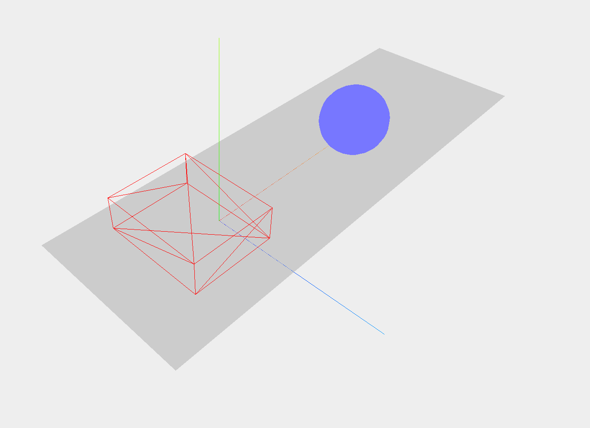
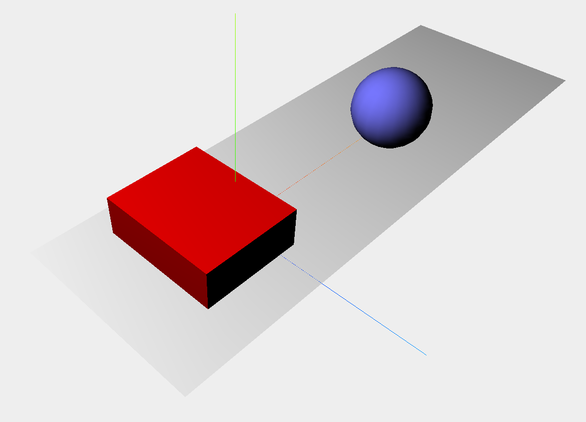
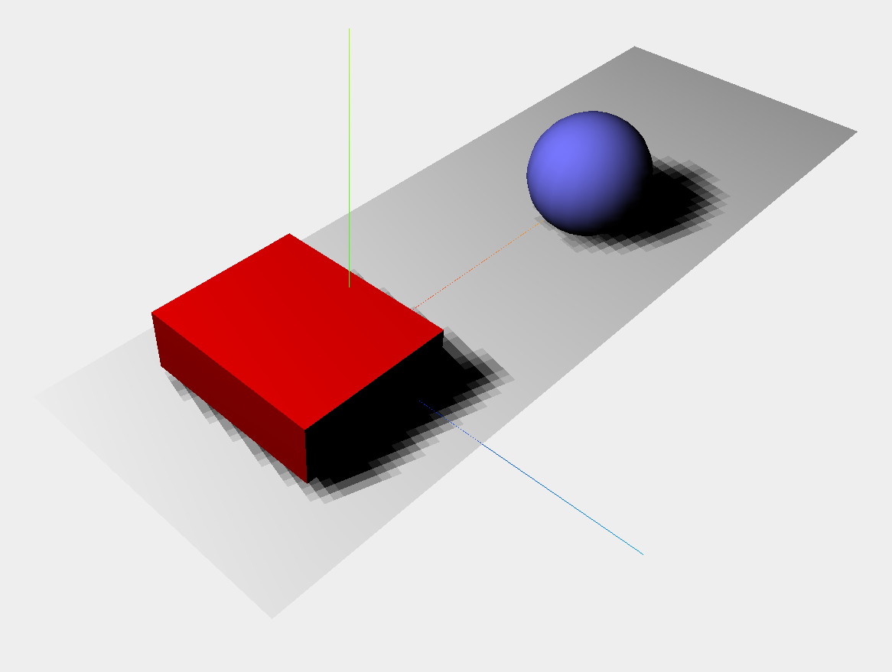

# before introduce...
집에 learning three js(2/e) 이 있길래 이걸로 진행한다. 참고로 번역본임. 때문에, 책에 좀 레거시한 부분들이 있을 수 있다. 이는 웬만하면 고치고 넘어갈 것임.

또한 ES6 문법을 사용하며, 당연히 js, webpack, git에 대한 지식이 있다고 가정하고 진행한다. 떄문에 책과는 좀 구조가 달라질 수도 있다. 큰 문제는 아니고, HMR 동작하는 구조까지 완성되었다고 가정하고 진행한다. [참고](https://github.com/Gumball12/learn_to_threejs/blob/master/notes/others/webpack.md)

# Chapter1; Create your first 3D Scene with Three.js
ThreeJS를 이용하면 WebGL의 Scene, Geometry, Material, Texture, Lightning, Load Model, After-treatment, Custom Shader, Cloud 그리고 Animate 등을 간단히 구현할 수 있다고 한다. 아직은 뭔 말인지 잘 모르겠고, 이러한 것들을 구현할 수 있다는 것만 알아두자.

다음과 같이 말이다. [예제](http://www.vill.ee/eye/)

매우 신기하지 않은가. 얼른 공부하도록 해 보자. 이번 챕터에서는 다음을 볼 것이다.

* Scene, Material, Lights, Animate, Helper 등을 구현
* Helper libraries

참고로 ThreeJS는 웹지엘 지원하면 다 된다. 즉, 데스크탑 브라우저 뿐만 아니라 모바일 브라우저에서도 구동된다는 말.

아무튼 뭐... 차근차근 해 보도록 하자. 먼저 다음 레포를 복사한다. 

[Github/josdirksen/learning-threejs](https://github.com/josdirksen/learning-threejs)

보면 알겠지만, 이 예제들을 이용해 진행할 것이다. 뭐... 말은 이렇게 했는데, 웬만하면 코드 다 적어가면서 진행 할 것이다. 책에서도 그렇게 진행하는 것 같고.

## implementing objects
다음 객체를 구현할 것이다.



* Scene, Renderer, Camera
  * Scene: 각종 객체들이 렌더되는 공간이다.
  * Renderer: WebGL 이용한 구현을 담당하는 객체
  * Camera: 객체를 비추는 역할
* Axes
  * 축을 나타내는 ThreeJS Helper
* Plane, Cube, Sphere
  * 구현할 객체들

갑작스럽지만 구현해보면 다음과 같다.

```js
import * as THREE from 'three'

/*
* init
*/

let scene, camera, renderer

function init () {
	createScene()

	createPlane()
	createCube()
	createSphere()

	animate()
}
init()

function createScene () {
	// create Scene
	scene = new THREE.Scene()

	// create Perspective Camera
	camera = new THREE.PerspectiveCamera(
		45, // fov
		window.innerWidth / window.innerHeight, // aspect
		0.1, // near reder limit
		1000 // far render limit
	)

	camera.position.x = -30 // camera positioning
	camera.position.y = 40
	camera.position.z = 30

	camera.lookAt(scene.position) // look at the Scene(0, 0, 0)

	// create renderer
	renderer = new THREE.WebGLRenderer()

	renderer.setClearColor(0xEEEEEE) // renderer setup (background, HEX)
	renderer.setSize(window.innerWidth, window.innerHeight)

	document.body.appendChild(renderer.domElement) // insert <canvas> element

	// create axes helper (not 'axis')
	const axes = new THREE.AxesHelper(20) // 20 = length

	scene.add(axes) // added scene
}

/*
* objects
*/

function createPlane () {
	// create plane
	const planeGeometry = new THREE.PlaneGeometry(60, 20, 1, 1)
	const planeMaterial = new THREE.MeshBasicMaterial({ color: 0xcccccc })
	
	const plane = new THREE.Mesh(planeGeometry, planeMaterial)
	plane.rotation.x = -Math.PI / 2 // rotate 90 deg
	plane.position.x = 15
	plane.position.y = 0
	plane.position.z = 0
	
	scene.add(plane)
}

function createCube () {
	// create cube
	const cubeGeometry = new THREE.BoxGeometry(10, 4, 12)
	const cubeMaterial = new THREE.MeshBasicMaterial({ color: 0xff0000, wireframe: true })
	
	const cube = new THREE.Mesh(cubeGeometry, cubeMaterial)
	cube.position.x = -4
	cube.position.y = 3
	cube.position.z = 0
	
	scene.add(cube)
}

function createSphere () {
	// create sphere
	const sphereGeometry = new THREE.SphereGeometry(4, 20, 20)
	const sphereMaterial = new THREE.MeshBasicMaterial({ color: 0x7777ff })
	
	const sphere = new THREE.Mesh(sphereGeometry, sphereMaterial)
	sphere.position.x = 20
	sphere.position.y = 4
	sphere.position.z = 2
	
	scene.add(sphere)
}

/*
* loops
*/

function animate () { // animation loop
	requestAnimationFrame(animate) // call 'animate' function by each frame(60hz)

	renderer.render(scene, camera) // renderer update
}
```
코드는 대충 알아먹을 수 있을 것이다. 참고로, _axes_ 라는 단어를 주의하자. axis가 아니다. axis와 axes는 나의 경우 종종 헛갈리는데, 이 둘의 차이는 다음과 같다고 한다. [출처](http://www.differencebetween.info/difference-between-axis-and-axes)

* Axis; 객체의 중심 선
  * 
* Axes; 객체의 축(xyz)
  * 

헛갈리지 말도록 하자.

### animation loop
매 frame마다 renderer을 이용해 그려줘야(update) 하기 때문에 다음과 같이 함수를 구현해 업데이트한다.

```js
function animate () {
  requestAnimationFrame(animate)
  renderer.render(scene, camera)
}
```
requestAnimationFrame에 대한 내용은 [js_tweening.md](../others/js_tweening.md) 을 참고.

### Docs

* [Scene](https://threejs.org/docs/#api/scenes/Scene)
  * 각종 objects가 위치할 공간
* [PerspectiveCamera](https://threejs.org/docs/#api/cameras/PerspectiveCamera)
  * 입체적인... 그러니까 멀리 떨어진 객체는 작아보이고, 가까이 있는 객체는 커보이도록 비추는 Camera
  * 다른 종류의 카메라로는 [OrthogonalCamera] 라고 있는데, 얘는 진행하며 배울 것이다.
* [WebGLRenderer](https://threejs.org/docs/#api/renderers/WebGLRenderer)
  * WebGL 이용해 객체 구현을 담당

* [AxesHelper](https://threejs.org/docs/#api/helpers/AxesHelper)
  * 3차원 축 xyz를 그린다.

* [PlaneGeometry](https://threejs.org/docs/#api/geometries/PlaneGeometry)
  * 사각형(2D)을 만드는 Geometry
* [BoxGeometry](https://threejs.org/docs/#api/geometries/BoxGeometry)
  * 육면체를 만드는 Geometry
* [SphereGeometry](https://threejs.org/docs/#api/geometries/SphereGeometry)
  * 구를 만드는 Geometry

* [MeshBasicMaterial](https://threejs.org/docs/#api/materials/MeshBasicMaterial)
  * 가장 기본적인 형태의 Material이다. solid 또는 wirframe으로 shading 할 수 있다고 함
  * 때문에 모든 부분이 shiny 하며, 조명에 영향을 받지 않는다.
  * 그림자는 만들 수 있다.
* [Mesh](https://threejs.org/docs/#api/objects/Mesh)
  * Geometry와 Material을 받아 Object를 생성
  * 이 객체를 Scene에 _add()_ 함으로써 해당 객체를 Scene에 추가할 수 있다.

## Add Lights and Shadows
조명과 그림자를 추가해보자 그냥... 조명을 추가해주고 그림자를 '켜'주면 된다.

### Add Lights
먼저 조명을 추가해보자.



[SpotLight]를 사용하며, 다음과 같이 가능하다.

```js
function init () {
  /* ... */

  createLights()
}

function createLights () {
	// create spot-light
	const spotLight = new THREE.SpotLight(0xffffff)
	spotLight.position.set(-40, 60, -10)

	scene.add(spotLight)
}
```
그냥 이대로 추가만 해주면 아무런 차이가 없다. [MeshBasicMaterial] 떄문. 다음과 같이 [MeshLambertMaterial] 을 이용해 새로운 Material을 구현해 주도록 하자.

```js
function createPlane () {
	// create plane
	const planeGeometry = new THREE.PlaneGeometry(60, 20, 1, 1)
	// const planeMaterial = new THREE.MeshBasicMaterial({ color: 0xcccccc })
	const planeMaterial = new THREE.MeshLambertMaterial({ color: 0xFFFFFF })
	
	const plane = new THREE.Mesh(planeGeometry, planeMaterial)
	plane.rotation.x = -Math.PI / 2 // rotate 90 deg
	plane.position.x = 15
	plane.position.y = 0
	plane.position.z = 0
	
	scene.add(plane)
}

function createCube () {
	// create cube
	const cubeGeometry = new THREE.BoxGeometry(10, 4, 12)
	// const cubeMaterial = new THREE.MeshBasicMaterial({ color: 0xff0000, wireframe: true })
	const cubeMaterial = new THREE.MeshLambertMaterial({ color: 0xFF0000 })
	
	const cube = new THREE.Mesh(cubeGeometry, cubeMaterial)
	cube.position.x = -4
	cube.position.y = 3
	cube.position.z = 0
	
	scene.add(cube)
}

function createSphere () {
	// create sphere
	const sphereGeometry = new THREE.SphereGeometry(4, 20, 20)
	// const sphereMaterial = new THREE.MeshBasicMaterial({ color: 0x7777ff })
	const sphereMaterial = new THREE.MeshLambertMaterial({ color: 0x7777FF })
	
	const sphere = new THREE.Mesh(sphereGeometry, sphereMaterial)
	sphere.position.x = 20
	sphere.position.y = 4
	sphere.position.z = 2
	
	scene.add(sphere)
}
```
[MeshBasicMaterial]로 구현되었던 Material이 [MeshLambertMateral]로 새롭게 구현되었다. 이것 말고는 차이가 없음.

### Add Shadows
이제 그림자를 추가해보도록 하자. 위에서도 말했지만, 별 것 없이 그냥 'ㅋㅕ' 주면 된다.



```js
function createScene () {
  /* ... */

	renderer.shadowMap.enabled = true // enable 'shadow'
}

function createPlane () {
  /* ... */

	plane.receiveShadow = true // set receive shadow
	
	scene.add(plane)
}

function createCube () {
  /* ... */

	cube.castShadow = true // set cast shadow
	
	scene.add(cube)
}

function createSphere () {
  /* ... */

	sphere.castShadow = true // set cast shadow
	
	scene.add(sphere)
}

function createLights () {
  /* ... */

  spotLight.castShadow = true // set cast shadow
	spotLight.shadow.mapSize.width = 2048 // set shadow pixel
	spotLight.shadow.mapSize.height = 2048

	scene.add(spotLight)
}
```
renderer에서 shadow를 사용하겠다고 설정한 다음, 다음 객체에서 shadow를 설정한다.

* receiveShadow: plane
  * 그림자가 그려질 객체
* castShadow: cube, sphere, lights
  * 그림자를 만들 객체

마지막으로 `spotLight.shadow.mapSize` 를 이용해 shadow의 quality를 지정한다. 기본값은 512이며, 이 값의 2의 배수로 지정해줘야 한다. width와 height의 값이 같을 필요는 없다. [mapSize docs](https://threejs.org/docs/#api/lights/shadows/LightShadow.mapSize)

### Docs

* [SpotLight](https://threejs.org/docs/#api/lights/SpotLight)
  * 어느 한 spot을 비추는 조명

* [MeshLambertMaterial](https://threejs.org/docs/#api/materials/MeshLambertMaterial)
  * 밝은 부분(shiny)과 그림자가 진 부분(non-shiny)이 있으며, 조명과 상호작용을 할 수 있다.

## Animation
위에서 언급했던 animation loop(`requestAnimationFrame`)를 이용해 애니메이션을 구현할 수 있다.

### Stats.js
그 전에 frame 속도를 측정할 수 있는 Stats.js를 먼저 설치?하도록 하자. [Stats.js Github](https://github.com/mrdoob/stats.js) [Stats.js npm](https://www.npmjs.com/package/stats.js)

```sh
$ yarn add stats.js
```

다음과 같이 추가할 수 있다.

```js
import Stats from 'stats.js'

/*
* init
*/

let stats

function init () {
	/* ... */

	createHelper()

	/* ... */
}

function createHelper () {
	// stats.js
	stats = new Stats()
	stats.setMode(0)
	stats.domElement.style.position = 'absolute'
	stats.domElement.style.left = '0px'
	stats.domElement.style.top = '0px'
	document.body.appendChild(stats.domElement)
}

function animate () {
	/* ... */

	stats.update() // stats.js
}
```
실행해보면 왼쪽 상단에 stats.js가 나타날 것이다. _setMode()_ 는 다음과 같이 지정할 수 있다.

* 0: fps
* 1: rendering time

물론 그냥 왼쪽 상단의 stats.js 클릭해서도 전환할 수 있다.

### animate cube
빨간색 상자에 animate를 적용해보겠다. 어려울 것은 없고 그냥 rotation 값을 계속 바꿔주는 것이다...

```js
/*
* init
*/

let cube, sphere

/* 
* 중간의 'const cube', 'const sphere' 을 'cube', 'sphere' 로 바꿔줌
*/

function animate () {
	/* ... */

	// animate cube
	cube.rotation.x += 0.02
	cube.rotation.y += 0.02
	cube.rotation.z += 0.02
}
```
이제 실행해보면 움직이는게 보일 것이다.

### animte sphere
이제 구를 움직여보도록 하자. trigonometric function 이용해서 바운싱해보도록 하겠다.

```js
var step = 0 // hoisting

function animate () {
	/* ... */

	// animate sphere
	sphere.position.y = 5 + Math.sin(step * 2)
	sphere.position.x = 15 + Math.sin(step) + Math.sin(step) * 5

	step += 0.05
}
```
그냥 뭐 이리저리 왔다갔다 하는게 보일 것이다.

### dat.GUI
이 장을 마치기 전에 data.GUI라고 변수를 쉽게 수정할 수 있도록 만든 모듈을 집어넣어보도록 하겠다. [dat.GUI github](https://github.com/dataarts/dat.gui) [dat.GUI npm](https://www.npmjs.com/package/dat.gui)

```sh
$ yarn add dat.gui
```

다음과 같이 추가할 수 있다.

```js
import * as dat from 'dat.gui'

/*
* init
*/

let stats, controls

function createHelper () {
	/* ... */

	// dat.GUI
	controls = {
		cubeAnimationSpeed: 0.02,
		sphereAnimationSpeed: 0.05
	}
	
	const gui = new dat.GUI()
	gui.add(controls, 'cubeAnimationSpeed', 0, 0.5) // 0: min, 0.5: max
	gui.add(controls, 'sphereAnimationSpeed', 0, 0.5)
}
```
코드가 정말 __좆병신__ 같지만 못볼 정도는 아닐 것이다. 이제 이 값으로 움직이도록 하자.

```js
function animate () {
	/* ... */
	
	// animate cube	
	cube.rotation.x += controls.cubeAnimationSpeed
	cube.rotation.y += controls.cubeAnimationSpeed
	cube.rotation.z += controls.cubeAnimationSpeed

	// animate sphere
	sphere.position.y = 5 + Math.sin(step * 2)
	sphere.position.x = 15 + Math.sin(step) + Math.sin(step) * 5

	step += controls.sphereAnimationSpeed
}
```
어떻게 돌아가는지는 대충 이해가 갈 것이다. 실행해보면 우측 상단에 컨트롤러가 나타나며, 마우스로 대충 값을 바꿔보면 그에따라 애니메이션의 속도도 달라지는것을 볼 수 있다.

## handle browser resize
마지막으로, 브라우저 창 크기에 맞춰 렌더하도록 설정해보도록 하겠다. 별거 없이 그냥 핸들러 이용하면 된다.

```js
function createScene () {
	/* ... */
	
	// handle resize
	window.addEventListener('resize', handleResize)
	function handleResize () {
		camera.aspect = window.innerWidth / window.innerHeight
		camera.updateProjectionMatrix()
		renderer.setSize(window.innerWidth, window.innerHeight)
	}
}
```
그냥 뭐... 화면비와 화면크기를 업데이트 해 주는 것이다...

## end
여기서는 대충 전체적으로 둘러보고, stats.js와 dat.GUI를 봤다.

### code

* [1-basic_threejs.js](js/chapter1/1-basic_threejs.js)
