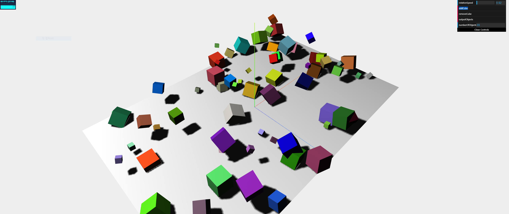
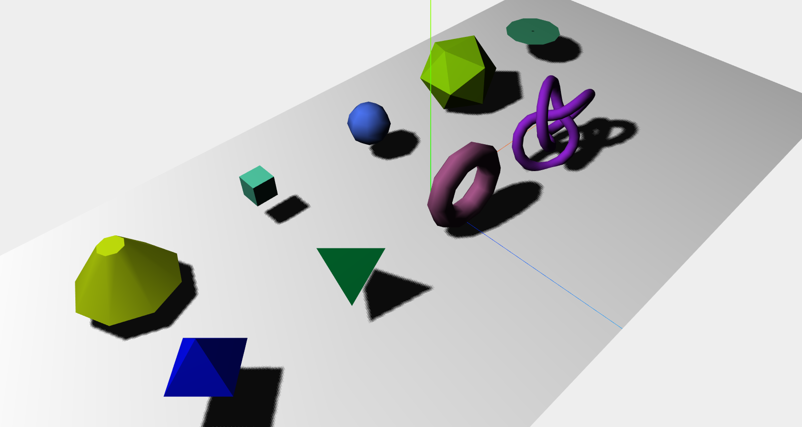
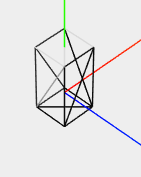
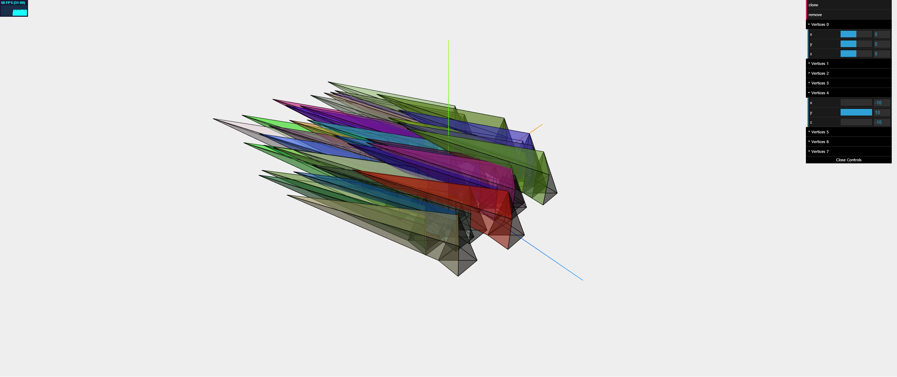
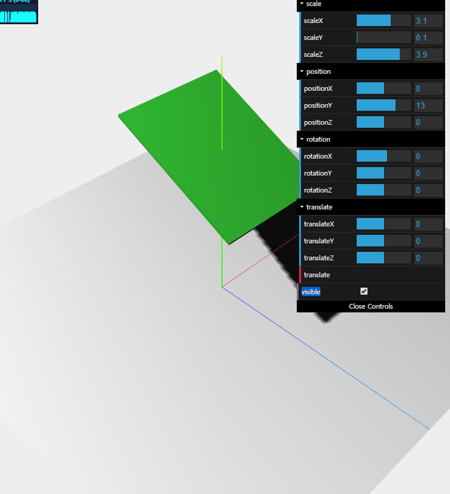
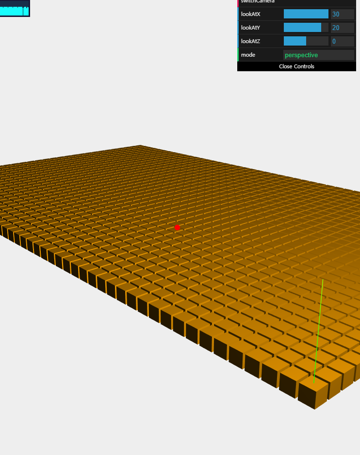

# Chapter2; Basic elements of ThreeJS Scene
여기서는 threeJS의 기본적인 구성요소에 대해 보도ㅗㄱ 하겠다. [Scene] 객체나 아니면 뭐...  Geometry, Mesh 그리고 Camera 등에 대해서 보고... 또

## Scene
Scene을 만들기 위해서는 다음이 먼저 구현되어야 한다.

* Camera
* Lights; chapter3 에서 봄
* Objects

### Basic Scene
일단 [예제 2 장의 01-basic-scene.html](https://github.com/josdirksen/learning-threejs/blob/master/chapter-02/01-basic-scene.html) 을 가져와 리뷰해보자. 대충 Scene에 대해 느낌이 올 것이다.

```js
import * as THREE from 'three'
import Stats from 'stats.js'
import * as dat from 'dat.gui'

/*
* init
*/

let scene, camera, renderer

let stats, controls

let plane

function init () {
	createScene()
	createHelper()

	createLights()

	createPlane()

	animate()
}
init()

function createScene () {
	// create Scene
	scene = new THREE.Scene()

	// create Perspective Camera
	camera = new THREE.PerspectiveCamera(
		45, // fov
		window.innerWidth / window.innerHeight, // aspect
		0.1, // near reder limit
		1000 // far render limit
	)

	camera.position.x = -30 // camera positioning
	camera.position.y = 40
	camera.position.z = 30

	camera.lookAt(scene.position) // look at the Scene(0, 0, 0)

	// create renderer
	renderer = new THREE.WebGLRenderer({
		antialias: true
	})

	renderer.setClearColor(0xEEEEEE) // renderer setup (background, HEX)
	renderer.setSize(window.innerWidth, window.innerHeight)
	
	renderer.render(scene, camera)

	renderer.shadowMap.enabled = true // enable 'shadow'

	document.body.appendChild(renderer.domElement) // insert <canvas> element

	// create axes helper (not 'axis')
	const axes = new THREE.AxesHelper(20) // 20 = length
	scene.add(axes) // added scene

	// handle resize
	window.addEventListener('resize', handleResize)
	function handleResize () {
		camera.aspect = window.innerWidth / window.innerHeight
		camera.updateProjectionMatrix()
		renderer.setSize(window.innerWidth, window.innerHeight)
	}
}

function createHelper () {
	// stats.js
	stats = new Stats()
	stats.setMode(0)
	stats.domElement.style.position = 'absolute'
	stats.domElement.style.left = '0px'
	stats.domElement.style.top = '0px'
	document.body.appendChild(stats.domElement)

	// dat.GUI
	controls = {
		rotationSpeed: 0.02,
		numberOfObjects: scene.children.length,

		removeCube () {
			const childrens = scene.children
			const lastObj = childrens[childrens.length - 1]

			if (lastObj instanceof THREE.Mesh) {
				scene.remove(lastObj) // remove object
				this.numberOfObjects = scene.children.length
			}
		},

		addCube () {
			const size = Math.ceil(Math.random() * 3)
			const geometry = new THREE.BoxGeometry(size, size, size)
			const material = new THREE.MeshLambertMaterial({ color: Math.random() * 0xffffff })
			const cube = new THREE.Mesh(geometry, material)

			cube.castShadow = true
			cube.name = `cube-${scene.children.length}` // mesh naming
			cube.position.x = -30 + Math.round(Math.random() * 60)
			cube.position.y = Math.round(Math.random() * 5)
			cube.position.z = -20 + Math.round(Math.random() * 40)

			scene.add(cube)
			this.numberOfObjects = scene.children.length
		},

		outputObjects () {
			console.log(scene.children)
		}
	}

	const gui = new dat.GUI()
	gui.add(controls, 'rotationSpeed', 0, 0.5)
	gui.add(controls, 'addCube')
	gui.add(controls, 'removeCube')
	gui.add(controls, 'outputObjects')
	gui.add(controls, 'numberOfObjects').listen()
}

/*
* objects
*/

function createPlane () {
	// create plane
	const planeGeometry = new THREE.PlaneGeometry(60, 40, 1, 1)
	const planeMaterial = new THREE.MeshLambertMaterial({ color: 0xFFFFFF })
	
	plane = new THREE.Mesh(planeGeometry, planeMaterial)
	plane.rotation.x = -Math.PI / 2 // rotate 90 deg
	plane.position.x = 0
	plane.position.y = 0
	plane.position.z = 0

	plane.receiveShadow = true // set receive shadow
	
	scene.add(plane)
}

function createLights () {
	// create spot-light
	const spotLight = new THREE.SpotLight(0xffffff)
	spotLight.position.set(-40, 60, -10)

	spotLight.castShadow = true // set cast shadow
	spotLight.shadow.mapSize.width = 2048 // set shadow pixel
	spotLight.shadow.mapSize.height = 2048

	scene.add(spotLight)

	const ambientLight = new THREE.AmbientLight(0x0c0c0c)
	scene.add(ambientLight)
}

/*
* loops
*/

function animate () { // animation loop
	requestAnimationFrame(animate) // call 'animate' function by each frame(60hz)
	renderer.render(scene, camera) // renderer update

	stats.update() // stats.js
	
	scene.traverse(el => { // iterate all objects
		if (el instanceof THREE.Mesh && el != plane) {
			el.rotation.x += controls.rotationSpeed
			el.rotation.y += controls.rotationSpeed
			el.rotation.z += controls.rotationSpeed
		}
	})
}
```
[코드](js/chapter2/1-scene.js)

[chapter1 내용](js/chapter1/1-basic_threejs.js)에서 크게 뭐 달라진 것은 없고... [Scene] 메서드 제외하고는 굳이 설명이 필요할까 싶기도 하다. 그냥 'animate 그리고 새로운 조명 [AmbientLight]가 추가되었다' 이정도? 실행하고 dat.GUI의 'addCube'를 누르면 다음과 같이 나올 것이다.



#### object nameing
참고로 _addCube()_ 를 보면 `cube.name` 을 이용해 object에 naming을 했는데, 이렇게 이름을 붙여주면 디버깅 시에도 좋지만 __직접 객체에 접근할 수도 있다__ 고 함. 다음과 같이 말이다.

```js
scene.getObjectByName(/* object name */)
```

더 진행하기 전에 Scene.fog, Scene.overrideMaterial 에 대해 보고 넘어가도록 하겠다. 재밌는?거라고 함.

### fog
Scene에 안개 효과를 준다. 두 가지 종류가 있다.

* [Fog]; 거리에 따라 linearly하게 짙어지는 안개
* [FogExp2]; 거리에 따라 exponentially하게 짙어지는 안개

각각 다음과 같이 적용할 수 있다.

```js
function createScene () {
  /* ... */

  scene.fog = new THREE.Fog(0xffffff, 0.015, 100) // color, near, far
  scene.fog = new THREE.FogExp2(0xffffff, 0.02) // color, density
}
```
이제와서 말하지만... scene 정의된 이후라면 어디에 위치하든 보통 상관은 없다. 그리고 안개 여러개 정의해봤자 가장 마지막에 설정한 안개로 들어간다.

### overrideMaterial
Scene 내 모든 material에 대해 override하는 것이다. 다음과 같이 가능하다.

```js
scene.overrideMaterial = new THREE.MeshLambertMaterial({ color: 0xffffff })
```
이렇게 해주면 해당 scene 내 모든 material이 `MeshLamberMaterial({ color: 0xffffff })` 가 된다.

### properties of the Scene
여기서 본 것들을 정리하자면 다음과 같다.

* add(): 객체 추가
  * 이 때 Scene.children Array에 push 된다고 생각하면 됨
* remove(): 객체 삭제
  * _add()_ 에서와 마찬가지로 객체 참조를 넣어줌으로써 가능하다.
* getObjectByName(): object name으로 가져오기
* traverse(): Scene의 모든 childrens 탐색

* children: Scene의 모든 childrens 목록을 가져온다.([Array])
* fog: 안개 설정
* overrideMaterial: 해당 Scene 내 모든 object에 대해 override할 material 설정

[Scene doc](https://threejs.org/docs/#api/scenes/Scene) 을 참고해도 좋을 것이다.

### Docs

* [AmbientLight](https://threejs.org/docs/#api/lights/AmbientLight)
  * 나중에 조명 설명할 때 나오긴 할건데... 전체적으로 밝게 해주는 조명이다.

* [Fog](https://threejs.org/docs/#api/scenes/Fog)
  * 선형적으로 짙어지는 안개를 생성
* [FogExp2](https://threejs.org/docs/#api/scenes/FogExp2)
  * 기하 급수적으로 짙어지는 안개를 생성

## Geometry, Mesh
Geometry와 Material을 합쳐 Mesh를 만들곤 했었다.

```js
const geometry = new THREE.SphereGeometry(4, 20, 20)
const material = new THREE.MeshBasicMaterial({ color: 0x7777ff })
const sphere = new THREE.Mesh(geometry, material)
```

### Geometry examples
다음 예제를 보도록 하자. ThreeJS에서 제공한 Geometry들이다. 참고로 책과는 다르게 [ConvexGeometry](https://threejs.org/examples/webgl_geometry_convex.html)와 [ParametricGeometry](https://threejs.org/examples/webgl_geometries_parametric.html)가 빠짐...



```js
function createObjects () {
	const geos = []

	geos.push(new THREE.CylinderGeometry(1, 4, 4))

	geos.push(new THREE.BoxGeometry(2, 2, 2))

	geos.push(new THREE.SphereGeometry(2))

	geos.push(new THREE.IcosahedronGeometry(4))

	const pts = []
	const detail = 0.1
	const radius = 3
	for (var angle = 0.0; angle < Math.PI; angle += detail) {
		pts.push(new THREE.Vector3(Math.cos(angle) * radius, 0, Math.sin(angle) * radius))
	}
	geos.push(new THREE.LatheGeometry(pts, 12))

	geos.push(new THREE.OctahedronGeometry(3))

	geos.push(new THREE.TetrahedronGeometry(3))

	geos.push(new THREE.TorusGeometry(3, 1, 10, 10))

	geos.push(new THREE.TorusKnotGeometry(3, 0.5, 50, 20))

	for (var i = 0, j = 0; i < geos.length; i++) {
		const material = new THREE.MeshLambertMaterial({ color: Math.random() * 0xffffff })
		const mesh = new THREE.Mesh(geos[i], material)
		mesh.castShadow = true

		mesh.position.x = -24 + (i % 5 * 12)
		mesh.position.y = 4
		mesh.position.z = -8 + (j * 12)

		if((i + 1) % 5 === 0) j++

		scene.add(mesh)
	}
}
```
[코드](js/chapter2/2-geometry_examples.js)

대충 잘 동작 할 것이다. chatper5와 chapter6에서 Geometry에 대해 좀 더 자세히 볼 것이고... 일단 지금은 Geometry가 무엇인지부터 살펴보자.

### ThreeJS Geometry
ThreeJS 뿐만 아니라 보통 Geometry 하면 다음고 ㅏ같은 의미를 갖는다고 생각하면 된다.

> 3D 공간에서의 Vertex, Egde 그리고 face들의 집합

ThreeJS에서는 이런 Geometry를 구현하기 위해 모든 요소들을 정의할 필요가 없었다. 가령 Cube를 예로 들자면, _width, length, depth_ 만 정의하면 되었다.

```js
new THREE.BoxGeometry(2, 2, 2)
```

물론 다음과 같이 하나하나 정의해서도 가능은 하다.

```js
const vertices = [
  new THREE.Vector3(1, 3, 1),
  new THREE.Vector3(1, 3, -1),
  new THREE.Vector3(1, -1, 1),
  new THREE.Vector3(1, -1, -1),
  new THREE.Vector3(-1, 3, -1),
  new THREE.Vector3(-1, 3, 1),
  new THREE.Vector3(-1, -1, -1),
  new THREE.Vector3(-1, -1, 1)
]

const faces = [
  new THREE.Face3(0,2,1),
  new THREE.Face3(2,3,1),
  new THREE.Face3(4,6,5),
  new THREE.Face3(6,7,5),
  new THREE.Face3(4,5,1),
  new THREE.Face3(5,0,1),
  new THREE.Face3(7,6,2),
  new THREE.Face3(6,3,2),
  new THREE.Face3(5,7,0),
  new THREE.Face3(7,2,0),
  new THREE.Face3(1,3,4),
  new THREE.Face3(3,6,4)
]

const geometry = new THREE.Geometry()

geometry.vertices = vertices
geometry.faces = faces
geometry.computeFaceNormals() // calc normal 필요한지는?잘 모르겠다..

const material = new THREE.MeshLambertMaterial({ color: 0xffffff })
const mesh = new THREE.Mesh(geometry, material)
scene.add(mesh)
```
ThreeJS에서 면은 항상 삼각형들의 모임으로 구성된다. 다음과 같이 말이다.



때문에, 직접 정의하는 경우 위와 같은 코드가 되는 것이다. 그럼 이를 이용하면 모든 vertices를 일일이 변경할 수 있지 않을까? 물론 가능하다.

```js
function createHelper () {
	// stats.js
	stats = new Stats()
	stats.setMode(0)
	stats.domElement.style.position = 'absolute'
	stats.domElement.style.left = '0px'
	stats.domElement.style.top = '0px'
	document.body.appendChild(stats.domElement)

	// dat.GUI
	function addControl (x, y, z) {
		return { x, y, z }
	}

	controlPoints = [] // GUI에서 조작될 vertices array
	let num = scene.children.length // number of objects

	const gui = new dat.GUI()

	gui.add({
		clone () {
			const clonedGeometry = controlObject.children[0].geometry.clone() // copy Geometry
			const materials = [ // for with 'wireframe'
				new THREE.MeshLambertMaterial({ opacity: 0.6, color: Math.random() * 0xffffff, transparent: true }),
				new THREE.MeshBasicMaterial({ color: 0x000000, wireframe: true })
			].map(el => {
				el.castShadow = true
				return el
			})

			const object = new THREE.Object3D() // group
			object.add(new THREE.Mesh(clonedGeometry, materials[0])) // [MeshLambertMaterial]
			object.add(new THREE.Mesh(clonedGeometry, materials[1])) // [MeshBasicMaterial] (wireframe)

			object.translateX(Math.random() * 20 - 10) // positioning
			object.translateZ(Math.random() * 20 - 10)
			object.name = `clone-${num}` // naming
	
			scene.add(object)

			num++ 
		}
	}, 'clone')

	gui.add({
		remove () {
			const last = scene.getObjectByName(`clone-${num - 1}`)

			if (/^clone-[\d]*$/.test(last.name)) { // iff last === clone object
				scene.remove(last)
				num--
			}
		}
	}, 'remove')

	controlPoints.push(addControl(3, 5, 3)) // for vertex group
	controlPoints.push(addControl(3, 5, 0))
	controlPoints.push(addControl(3, 0, 3))
	controlPoints.push(addControl(3, 0, 0))
	controlPoints.push(addControl(0, 5, 0))
	controlPoints.push(addControl(0, 5, 3))
	controlPoints.push(addControl(0, 0, 0))
	controlPoints.push(addControl(0, 0, 3))

	for (var i = 0; i < 8; i++) {
		const folder = gui.addFolder(`Vertices ${i}`) // dat.GUI folder
		folder.add(controlPoints[i], 'x', -10, 10) // append
		folder.add(controlPoints[i], 'y', -10, 10)
		folder.add(controlPoints[i], 'z', -10, 10)
	}
}

function animate () { // animation loop
	requestAnimationFrame(animate) // call 'animate' function by each frame(60hz)
	renderer.render(scene, camera) // renderer update

	stats.update() // stats.js

	const vertices = [] // for merge the 'controlPoints'
	for(var i = 0; i < controlPoints.length; i++) { // merge
		vertices.push(new THREE.Vector3(controlPoints[i].x, controlPoints[i].y, controlPoints[i].z))
	}

	scene.traverse(el => {
		if (/^clone-[\d]*$/.test(el.name)) { // iff element === cloned object
			for (var i = 0; i < 8; i++) { // modify vertices
				const v0 = el.children[0].geometry.vertices[i]
				const v1 = el.children[1].geometry.vertices[i] // wireframe

				v0.x = vertices[i].x
				v0.y = vertices[i].y
				v0.z = vertices[i].z
				
				v1.x = vertices[i].x
				v1.y = vertices[i].y
				v1.z = vertices[i].z
			}
			el.children[0].geometry.verticesNeedUpdate = true // inform vertices update to ThreeJs
			el.children[1].geometry.verticesNeedUpdate = true
		}
	})
}
```
[코드](js/chapter2/3-custom_geometry.js)

대략 다음과 같다.



좀 보자면...

* geometry.verticesNeedUpdate
	* ThreeJS는 성능상의 이유로 Geometry를 caching 해놓는다. 때문에, _true_ 로 변경함을 알리지 않으면 Geometry를 수정할 수 없다.
* [Object3D]
	* 그냥 object grouping을 위해서 사용한 객체
	* 책에서는 [SceneUtils](https://github.com/mrdoob/three.js/blob/master/examples/js/utils/SceneUtils.js)를 사용해서... 뭐 어쩌구 하는데... 나는 그냥 이걸로 구현해줬다... 큰 차이는 없는듯...
* geometry.clone()
	* 그냥 말그대로 Geometry 복사하는것이다.

이정도면 설명이 되었을까? 잘 모르겠다.

### ThreeJS Mesh
뭐... Geometry와 Material을 이용해 Mesh를 생성했다고 하면, 이를 Scene에 추가할 수 있다는 것을 이제 알 것이다. 추가 시 위치와 어떻게 나타날 지 설정할 수 있는 properties가 있다. 다음을 보자.

* mesh.position = {x, y, z}
	* 부모에 상대적인 위치로 결정한다. 여기서 부모는 [Scene] 또는 [Object3D]가 되겠지
* mesh.rotation = {x, y, z}
	* 말 그대로 회전을 지정하는 것
* mesh.scale = {x, y, z}
	* 크기지정

* mesh.rotateX(), mesh.rotateY(), mesh.rotateZ()
	* 각각의 축 별로 rotation을 지정하는 것
* mesh.translateX(), mesh.translateY(), mesh.translateZ()
	* 이동. 자신의 위치 기준으로.
* mesh.translateOnAxis(_axis_, _dist_)
	* 축 지정 이동. 마찬가지로 가신의 위치 기준임

* mesh.position.set(_x_, _y_, _z_)
	* 한 번에 position 지정
* mesh.rotation.set(_x_, _y_, _z_)
	* 한 번에 rotation 지정

* visible
	* 렌더여부지정. false가 당연히 disabled render

대충 뭘 뜻하는 지는 느낌이 올 텐데, 예를 보며 좀 더 이해해보도록 하자.

```js
function createHelper () {
	/* ... */

	// dat.GUI
	controls = {
		scaleX: 1,
		scaleY: 1,
		scaleZ: 1,

		positionX: 0,
		positionY: 4,
		positionZ: 0,

		rotationX: 0,
		rotationY: 0,
		rotationZ: 0,

		translateX: 0,
		translateY: 0,
		translateZ: 0,
		translate () {
			cube.translateX(controls.translateX)
			cube.translateY(controls.translateY)
			cube.translateZ(controls.translateZ)

			controls.positionX = cube.position.x
			controls.positionY = cube.position.y
			controls.positionZ = cube.position.z
		},

		visible: true
	}

	const gui = new dat.GUI()

	const guiScale = gui.addFolder('scale')
	guiScale.add(controls, 'scaleX', 0, 5)
	guiScale.add(controls, 'scaleY', 0, 5)
	guiScale.add(controls, 'scaleZ', 0, 5)

	const guiPosition = gui.addFolder('position')
	guiPosition.add(controls, 'positionX', -10, 10)
	const positionY = guiPosition.add(controls, 'positionY', -4, 20)
	const positionZ = guiPosition.add(controls, 'positionZ', -10, 10)

	/* 아래서 position.x = controls.positionX 로 구현됨
	positionX.listen()
	positionX.onChange(() => { cube.position.x = controls.positionX })
	*/

	positionY.listen()
	positionY.onChange(() => { cube.position.y = controls.positionY })

	positionZ.listen()
	positionZ.onChange(() => { cube.position.z = controls.positionZ })

	const guiRotation = gui.addFolder('rotation')
	guiRotation.add(controls, 'rotationX', -4, 4)
	guiRotation.add(controls, 'rotationY', -4, 4)
	guiRotation.add(controls, 'rotationZ', -4, 4)

	const guiTranslate = gui.addFolder('translate')
	guiTranslate.add(controls, 'translateX', -10, 10)
	guiTranslate.add(controls, 'translateY', -10, 10)
	guiTranslate.add(controls, 'translateZ', -10, 10)
	guiTranslate.add(controls, 'translate')

	gui.add(controls, 'visible')
}

function animate () { // animation loop
	/* ... */

	cube.visible = controls.visible

	cube.rotation.x = controls.rotationX
	cube.rotation.y = controls.rotationY
	cube.rotation.z = controls.rotationZ

	cube.position.x = controls.positionX

	/* 위에서 onChange() 로 구현됨
	cube.position.y = controls.positionY
	cube.position.z = controls.positionZ
	*/

	cube.scale.set(controls.scaleX, controls.scaleY, controls.scaleZ)
}
```
[코드](js/chapter2/4-mesh_example.js)

중간에 '~로 구현됨' 이라는 말이 있는데, 그냥 여러가지 방법으로 controls 값을 listen 할 수 있다는 것을 보여주는 것이다. 중요한 건 이게 아니고... 실행해보면서 _position, rotation, visible, translate_ 건드려보자.



#### [Vector3]
위치 지정할 때 position 속성으로 지정하곤 했는데, 사실 [Vector3] 객체이기 때문에, 다음과 같이도 지정이 가능하다.

```js
cube.position = new THREE.Vector3(10, 12, 4)
```

이는 rotation도 동일하다.

```js
cube.rotation = new THREE.Vecotr(Math.pi / 2, 0, 0)
```

마찬가지로 scale에도 동일하다.

```js
cube.scale = new THREE.Vector(2, 2, 2)
```

### Docs

* [Object3D](https://threejs.org/docs/#api/core/Object3D)
	* 기본적으로 3D 공간에 객체를 생성하기 위해 사용되는 class
		* Grouping을 위해 사용할 수도 있다(_add()_)
		* 참고로 Grouping은 [Group]을 extended 하는게 좀 더 효율?적이라고 함
	* 얘로 생성해도 일반적인 [Mesh]와 다를게 업승ㅁ
		* 위에서 언급되는 Mesh API도 이 문서를 보고 알 수 있다.

* [Vector3](https://threejs.org/docs/#api/math/Vector3)
	* 3D 공간상의 좌표
	* [Vector2]와 [Vector4] 도 있다. 나중에 언급될 듯

## Camera
동작 방법에 대해서는 [chapter3](chapter3.md) 에서 다룰 것이다. 여기서는 ThreeJS에서 구현되어있는 두 종류의 Camera에 대해 볼 것이다.

* Perspective Camera; 원근 카메라
* Orthographic Camera; 직교 카메라

차이점은 예제를 보며 이해하도록 하자. 대충 느낌 오겠지만.


```js
function createHelper () {
	// stats.js
	stats = new Stats()
	stats.setMode(0)
	stats.domElement.style.position = 'absolute'
	stats.domElement.style.left = '0px'
	stats.domElement.style.top = '0px'
	document.body.appendChild(stats.domElement)

	// dat.GUI
	controls = {
		mode: 'perspective',
		switchCamera () {
			if (camera instanceof THREE.PerspectiveCamera) {
				camera = new THREE.OrthographicCamera(
					window.innerWidth / -16,
					window.innerWidth / 16,
					window.innerHeight / 16,
					window.innerHeight / -16,
					-200, 500
				)

				camera.position.x = -40 // camera positioning
				camera.position.y = 51
				camera.position.z = -62
			
				camera.lookAt(20, 20, 0)

				controls.mode = 'orthographic'
			} else {
				camera = new THREE.PerspectiveCamera(
					45,
					window.innerWidth / window.innerHeight,
					0.1,
					1000
				)

				camera.position.x = -40 // camera positioning
				camera.position.y = 51
				camera.position.z = -62
			
				camera.lookAt(20, 20, 0)

				controls.mode = 'perspective'
			}
		},
		lookAtX: 20,
		lookAtY: 20,
		lookAtZ: 0
	}

	const gui = new dat.GUI()
	gui.add(controls, 'switchCamera')
	gui.add(controls, 'lookAtX', -30, 30)
	gui.add(controls, 'lookAtY', -30, 30)
	gui.add(controls, 'lookAtZ', -30, 30)
	gui.add(controls, 'mode').listen()
}
```
[코드](js/chapter2/5-camera_example.js)



### Perspective Camera
말 그대로 거리에 따라 물체의 크기가 다르게 렌더된다.


arguments는 다음과 같다. 들어가는 순서대로임

* fov
	* 말 그대로 Field of View. 시야각임.
	* 보통 60 ~ 90. 50 선택한다고 한다.
* aspect
	* 화면비
	* horizontal FOV와 vertical FOV 간의 차이를 결정한다고 함
* near
	* 최단 렌더 경계
* far
	* 최장 렌더 경계
* zoom
	* 구현시에는 값이 들어가지 않았다. 기본값은 1이며
	* negative 값으로 넣을 시 Scene이 거꾸로 뒤집혀 렌더된다고 함


### Orthographic Camera
거리 상관없이 모두 같은 비율을 갖도록 렌더된다.


arguments는 다음과 같다. 마찬가지로 들어가는 순서대로임

* left, right, top, bottom
	* 각각 해당 방향의 렌더 경계를 의미
* near
	* 최단 렌더 경계
* far
	* 최장 렌더 경계
* zoom
	* 얘도 마찬가지로 생략되었고, 기본값은 1.
	* negative value 시 Scene이 거꾸로 뒤집힌다. 마찬가지로.


### lookAt
예제에서 언급?구현?되어있는데, 말 그대로 해당 위치를 보도록 카메라에게 지시하는 것이다. 코드에서처럼 하나하나 지정할 수도 있고, [Vector3] 객체를 이용해 넣을수도 있다.

```js
camera.lookAt(x, y, z)
camera.lookAt(new THREE.Vector3(x, y, z))
```
지정안할시 중앙값(0, 0, 0)이 들어간다.

### Docs

* [PerspectiveCamera](https://threejs.org/docs/#api/cameras/PerspectiveCamera)
	* 원근 카메라
* [OrthographicCamera](https://threejs.org/docs/#api/cameras/OrthographicCamera)
	* 직교 카메라

## end
여기서는 Scene, Geometry, Mesh에 대해 보았다. 나온 코드들은 모두 다음과 같다.

### code

* [1-scene.js](js/chapter2/1-scene.js)
* [2-geometry_examples.js](js/chapter2/2-geometry_examples.js)
* [3-custom_geometry.js](js/chapter2/3-custom_geometry.js)
* [4-mesh_example.js](js/chapter2/4-mesh_example.js)
* [5-camera_example.js](js/chapter2/5-camera_example.js)