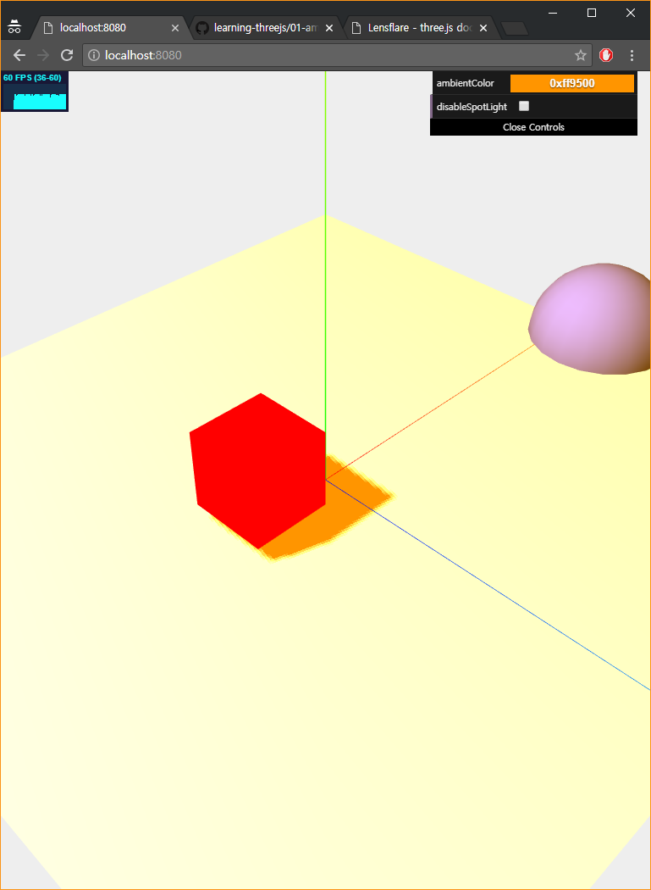
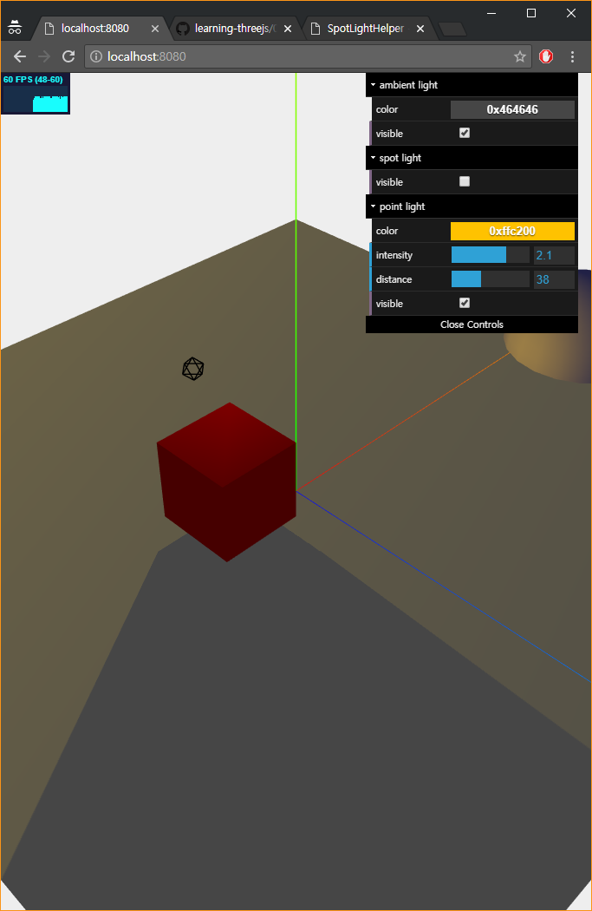
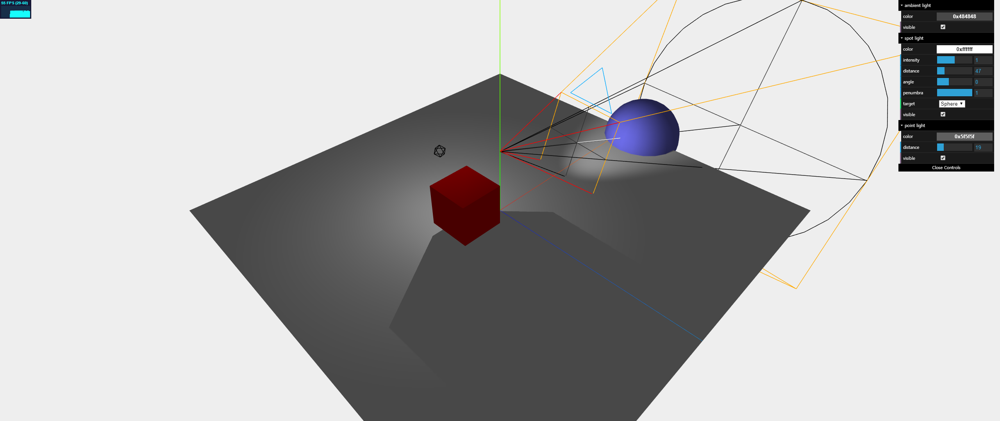
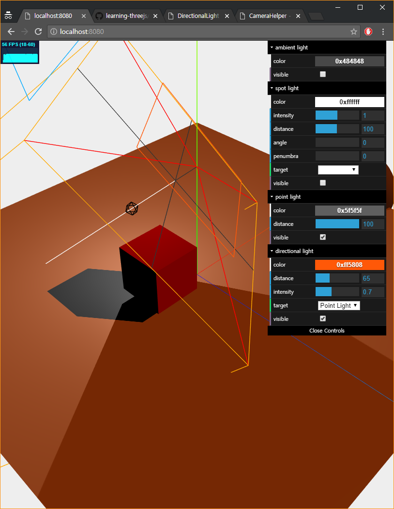
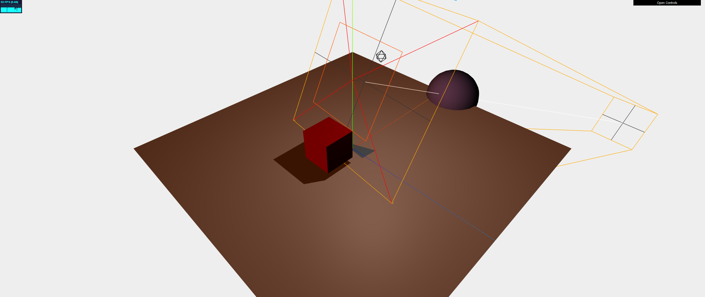
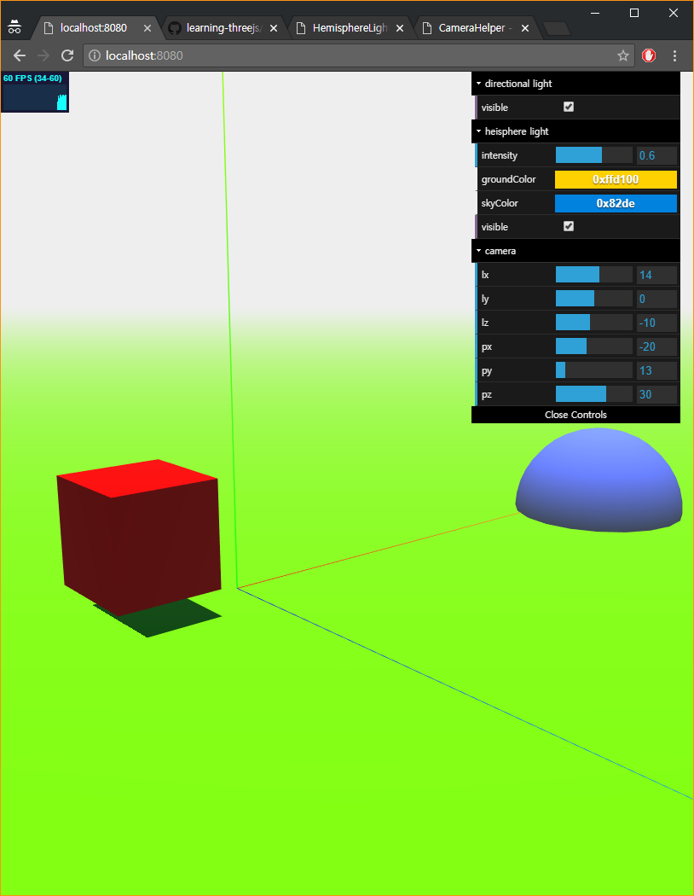
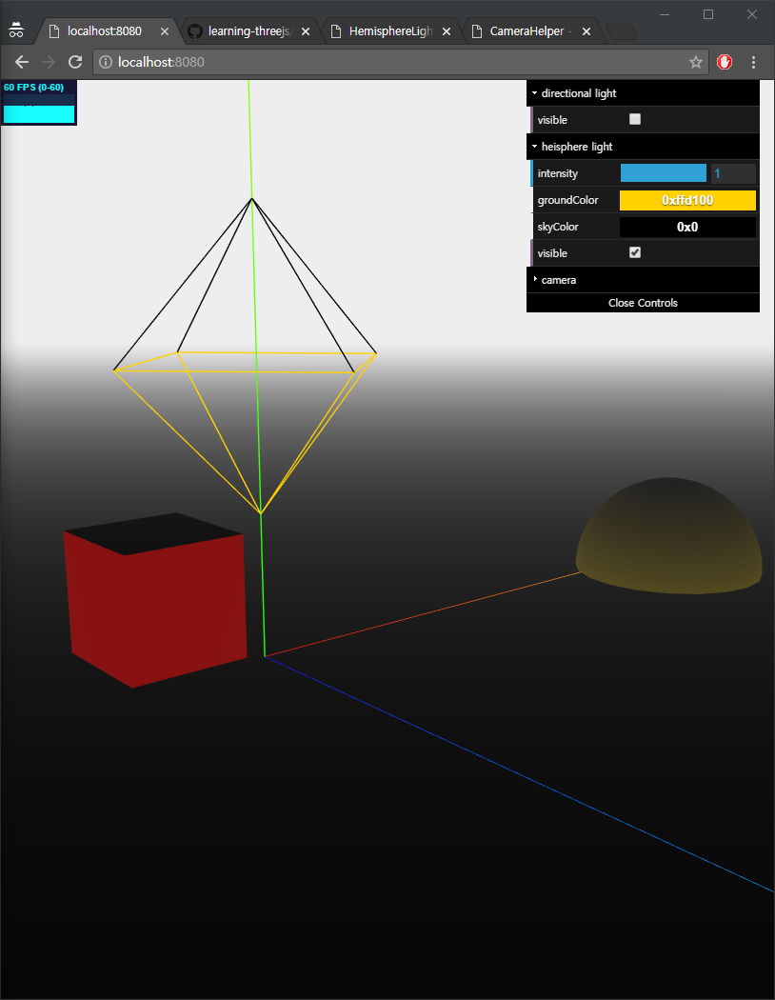
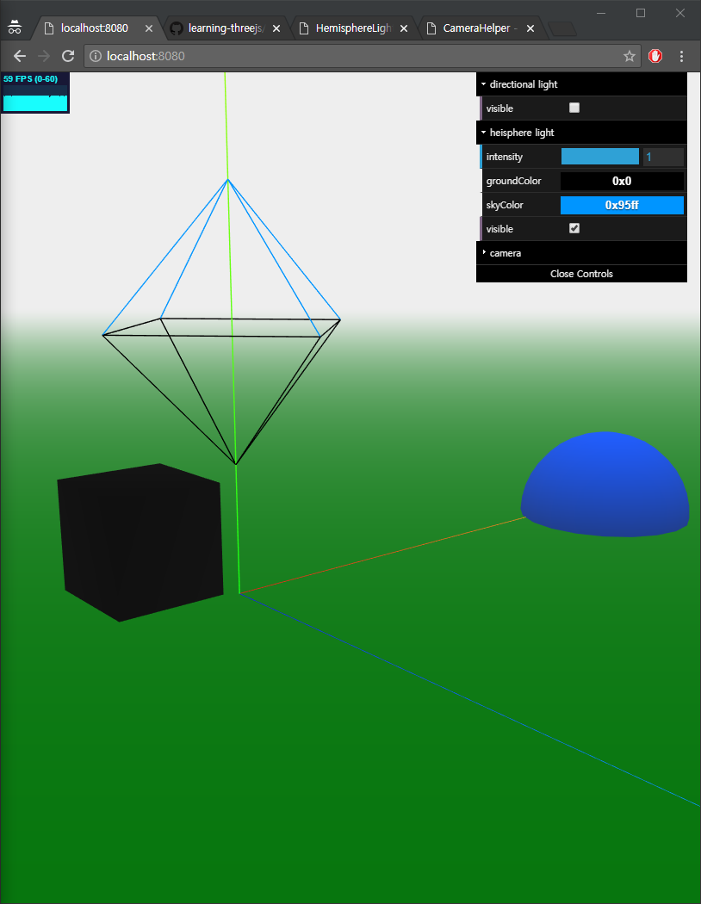

# Chater3; Lights
여러가지가 있다. 중요한 조명에 대해 다음을 다룬다고 함

## ThreeJS Lights
ThreeJS에서 조명은 다음이 구현되어있다. [RectAreaLight], [LensFlare] 제외하고 모두 알아볼 것이다.

* [AmbientLight](https://threejs.org/docs/#api/lights/AmbientLight)
  * 전체적으로 동일한 조명을 적용. 시작점이 없고 그림자를 만들지 않는다.
  * 모든 방향으로 조명이 적용된다.
  * 보통 부드러운 그림자나 추가적인 색상을 입히는데 사용하곤 한다고 함
* [PointLight](https://threejs.org/docs/#api/lights/PointLight)
  * 한 점에서 모든 방향으로 확산되는 조명
  * 그림자를 __만들 수 있다__.
* [SpotLight](https://threejs.org/docs/#api/lights/SpotLight)
  * 스포트라이트
  * 그림자를 만들 수 있다.
* [DirectionalLight](https://threejs.org/docs/#api/lights/DirectionalLight)
  * 태양이라고 생각하면 된다.
  * 그림자를 만 수 있으며 한 방향으로 무한히 뻗어나가는 조명
* [HemisphereLight](https://threejs.org/docs/#api/lights/HemisphereLight)
  * 표면 반사, 희미한 하늘 따위를 흉내?내는 조명
  * 좀ㅈ 더 자연스러운 외부광을 만드는 데 사용된다고 한다.
  * 그림자를 만들 수 없다.
* [RectAreaLight](https://threejs.org/docs/#api/lights/RectAreaLight)
  * 빛을 발산하는 공간을 정의할 수 있다. 창문 ㅜ머 이런거 생각하면됨
	* 다루지 않음
* [LensFlare](https://threejs.org/docs/#examples/objects/Lensflare)
  * 조명은 아니고, 조명에 렌즈 플레어 효과를 줄 수 있다.
	* 다루지 않음

AmbientLight, PointLight, SpotLight, DirectionalLight 얘네는 기본 광원이며 대부분의 시나리오에서 사용된다. 차이점은 다음 그림을 보자.


HemisphereLight, RectAreaLight, LensFlare 얘네는 특수 광원이며 특별한 목적을 가진다.

## Basic Lights
일반적인 조명들에 대해 보자. 예제는 하나하나 추가해가며 끝에는 모든 Lights가 구현된 Scene으로 만들어 볼 예정이다. 중요한 것은 이게 아니고...

### AmbientLight
전체... 그러니까 모든 Objects에 적용되는 조명이다. 때문에, 그림자가 생기지 않으며 모든 방향에서 조명이 적용된다. 언급했듯이 보통 단독으로 쓰이지 않으며 부드러운 그림자나 추가적인 색상 뭐 이런거에 쓴다고 한다.

다음 예제를 보며 뭐 하는 애인지 좀 보도록 ㅏㅎ자.



```js
function createHelper () {
  /* ... */

	// dat.GUI
	controls = {
		ambientLight: {
			color: 0x0c0c0c,
			visible: true
		},
		spotLight: {
			visible: true
		}
	}

	const gui = new dat.GUI()

	const ambientFolder = gui.addFolder('ambient light')
	ambientFolder.addColor(controls.ambientLight, 'color').onChange(c => { ambientLight.color = new THREE.Color(c) })
	ambientFolder.add(controls.ambientLight, 'visible').onChange(v => { ambientLight.visible = v })

	const spotFolder = gui.addFolder('spot light')
	spotFolder.add(controls.spotLight, 'visible').onChange(v => { spotLight.visible = v })
}

function createLights () {
	// create ambient light
	ambientLight = new THREE.AmbientLight(0x0c0c0c)
	scene.add(ambientLight)

	// create spot light
	spotLight = new THREE.SpotLight(0xffffff)
	spotLight.position.set(-40, 60, -10)

	spotLight.castShadow = true // set cast shadow
	spotLight.shadow.mapSize.width = 2048 // set shadow pixel
	spotLight.shadow.mapSize.height = 2048

	scene.add(spotLight)
}
```
[ambientlight.js](js/chapter3/ambientlight.js)

[SpotLight]는 뒤에서 볼 것이다. 크게 뭐 볼 것도 없고, 코드도 그냥 Chapter1 예제 거의 재사용한 것일 뿐이다. 굳이 봐야하는 것이 있다면, 조명에 색상을 새로이 집어넣는것과 [Color].

#### properties of AmbientLight
따로 설명해야 할... properties는 없다고 생각한다.

* .color
  * 색상

#### Color
잠시 보고 넘어가자. ThreeJS에서는 색을 구현(지정)할 때 Hex, REG 또는 그냥 Colorname 으로 지정하곤 했는데, 위에서와 같이 새로이 색을 지정할 때는 [Color]를 사용할 수 있다.

뭐... 책에서는 거의 레퍼런스만큼 properties에 대해 설명을 써 놓았는데, 여기서까지 그럴 필요는 없을 것 같고... 그냥 위와 같이 가능하다는 것만 알고 넘어가자. 굳이 필요하다 싶으면 문서 보면 되니가...

### PointLight
위의 그림에서 보았듯이 한 점에서 모든 방향으로 뻗어나가는 조명이다. 그림자를 만들 수 있다. 책에서는 만들 수 없다고 했는데, 후에 버전업에서 바뀐듯.



참고로 중간의 검은색 object는 Helper다. 코드에서 볼 수 있다.

```js
function createHelper () {
  /* ... */

	// dat.GUI
	controls = {
    /* ... */

		pointLight: {
			color: 0x000000,
			intensity: 1,
			distance: 100,
			visible: true
		}
  }
  
  /* ... */

	const pointFolder = gui.addFolder('point light')
	pointFolder.addColor(controls.pointLight, 'color').onChange(c => { pointLight.color = new THREE.Color(c) })
	pointFolder.add(controls.pointLight, 'intensity', 0, 3).onChange(i => { pointLight.intensity = i })
	pointFolder.add(controls.pointLight, 'distance', 0, 100).onChange(d => { pointLight.distance = d })
	pointFolder.add(controls.pointLight, 'visible').onChange(v => {
		pointLight.visible = v
		pointLightHelper.visible = v
	})
}

function createLights () {
  /* ... */

	// create point light
	pointLight = new THREE.PointLight(0x000000)
	pointLight.distance = 100
	pointLight.castShadow = true
	scene.add(pointLight)

	pointLightHelper = new THREE.PointLightHelper(pointLight, 0.6)
	scene.add(pointLightHelper)
}

function animate (step) { // animation loop
  /* ... */

	// animate pointlgiht
	pointLight.position.y = Math.sin(Math.ceil(step) * 0.001) * 5 + 10
	pointLight.position.x = Math.cos(Math.ceil(step) * 0.001) * 5
	pointLight.position.z = Math.sin(Math.ceil(step) * 0.001) * 5
}
```
[pointlight.js](js/chapter3/pointlight.js)

뭐 하나하나보면 이해안갈것은 없다고 생각한다. 참고로 [PointLightHelper]를 사용해 Pointlight의 Helper. 즉, 위치를 나타낼 수 있다.

마지막으로 그냥 위아래로 움직이는 동작을 animation loop에 추가해봄

#### properties of PointLight
다음을 지정할 수 있다. 물론 이 말고도 많겠지만... 대충 뭔지는 알 것이다.(position이나 visible 이런것들...)

* .color
  * 색상
* .distance (default: 0)
  * 말 그대로 빛이 도달할 수 있는 거리다.
  * 기본값 0은 거리가 없다(inf)는 의미. 즉, 해당 점에서 모든 방향으로 무한히 뻗어나간다.
* .intensity (default: 1)
  * 빛의 세기
* .castShadow
  * 그림자 여부

### SpotLight
지금까지 얼떨결에 사용해 왔듯이... 자주 사용하는 광원 중 하나라고 한다. 특히 그림자를 사용할 때 사용한다고 한다.

한 점에서 시작해 원뿔 모양으로 빛을 뿌린다. 플래시를 생각하면 되겠다. 예를 보면서 뭔 소린가 이해해보도록 하자. 참고로 여기서도 마찬가지로 Helper를 사용할 것이다.



```js
function createLights () {
	/* ... */

	// create spot light
	spotLight = new THREE.SpotLight(0xffffff)
	spotLight.position.set(0, 10, 0)

	spotLight.castShadow = true // set cast shadow

	spotLight.shadow.mapSize.width = 2048 // set shadow pixel
	spotLight.shadow.mapSize.height = 2048

	spotLight.target = cube // set target
	// spotLight.lookAt(0, 0, 0) // 다른 targeting 방법들
	// spotLight.lookAt(new THREE.Vector3(1, 3, 0))
	
	spotLight.shadow.camera.near = 10 // constant
	spotLight.shadow.camera.far = 15
	spotLight.shadow.camera.fov = 30

	spotLight.distance = 0
	spotLight.angle = 0.4
	scene.add(spotLight)

	spotLightHelper = new THREE.SpotLightHelper(spotLight, new THREE.Color(0x000000)) // spotlight의 light Helper
	scene.add(spotLightHelper)

	shadowSpotLightHelper = new THREE.CameraHelper(spotLight.shadow.camera) // spotlight의 shadow Helper
	scene.add(shadowSpotLightHelper)
}

function createHelper () {
	/* ... */

	// dat.GUI
	controls = {
		/* ... */

		spotLight: {
			color: 0xffffff,
			intensity: 1,
			distance: 100,
			angle: 0,
			penumbra: 0,
			target: 'cube',
			visible: true
		}
	}

	const gui = new dat.GUI()

	const spotFolder = gui.addFolder('spot light')
	spotFolder.addColor(controls.spotLight, 'color').onChange(c => { spotLight.color = new THREE.Color(c) })
	spotFolder.add(controls.spotLight, 'intensity', 0, 2).onChange(val => { spotLight.intensity = val })
	spotFolder.add(controls.spotLight, 'distance', 5, 200).onChange(val => { spotLight.distance = val })
	spotFolder.add(controls.spotLight, 'angle', 0, Math.PI / 3).onChange(val => { spotLight.angle = val })
	spotFolder.add(controls.spotLight, 'penumbra', 0, 1).onChange(val => { spotLight.penumbra = val })
	spotFolder.add(controls.spotLight, 'target', ['Cube', 'Sphere', 'Plane']).onChange(el => {
		switch(el) {
			case 'Cube': {
				spotLight.target = cube
				break
			}
			case 'Sphere': {
				spotLight.target = sphere
				break
			}
			case 'Plane': {
				spotLight.target = plane
				break
			}
		}
	})	
	spotFolder.add(controls.spotLight, 'visible').onChange(v => {
		spotLight.visible = v
		spotLightHelper.visible = v
	})
	
	/* ... */
}

function animate (step) { // animation loop
	/* ... */

	// animate post light
	spotLight.position.y = Math.sin(Math.ceil(step) * 0.001) * 5 + 10

	// spot light helper
	spotLightHelper.update()
	shadowSpotLightHelper.update()
}
```
[spotlight.js](js/chapter3/spotlight.js)

distance와 near, far가 혼동될 수 있는데, 이는 아래 설명에서 언급하도록 하겠다. 예제를 보며 어떻게 동작하는지 보도록 하자.

자주 쓰이는 조명인만큼 세세한 설정이 가능하다. 때문에, 주의깊게 보지 않으면 혼동이 생길 수 있으니 잘 보도록 하자. 정 이해안가면 한 번 구현해보는것도 괜찮다고 생가갛낟.

#### properties of SpotLight
다음의 속성들이 있다.

* angle (default: `Math.PI / 3`)
	* radian 값이다. 말 그대로 광원으로부터 빛이 얼마나 넓게 ㅓㅍ져가는지를 결정
* distance (default: 0)
	* 빛이 뻗어나가는 거리
	* 기본값인 _0_ 은 inf를 의미함. (거리에 따라 빛의 세기가 감소하지 않음)
* intensity (default: 1)
	* 빛의 세기
* penumbra (default: 0)
	* 빛의 경계를 얼마나 흐리게 할 것인지 설정
* target
	* _lookAt()_ 뿐만 아니라 _target_ 으로도 바라볼 대상(위치)을 지정할 수 있다.
	* 참고로 target으로 지정할 때 대상은 반드시 [Object3D]... 그러니까 Mesh 여야 한다.
		* 이를 좀 응용하면 그냥 빈 [Object3D] 객체 만들어서 계속 바라보게 할 수도 있겠지...

* castShadow
* onlyShadow (default: false)
	* true 시 그림자만 만들고 조명은 생기지 않는다.
* shadowBias (default: 0)
	* 그림자를 객체쪽으로 이동시킨다. (상쇄)

* color, position, visible

아래는 렌더링 뒤 변경이 불가능한 속성들이다.

* shadow.camera.near (default: 50)
	* 그림자의 시작 경계
* shadow.camera.far (default: 5000)
	* 그림자의 끝 경계
	* distance와 다른점은 얘는 '그림자'에 대한 설정이라는 것. distance는 '조명'에 대한 설정이라는 것.
* shadow.camera.fov (default: 50)
	* 그림자에 대한 FOV 설정
* shadow.mapSize.width, shadow.mapSize.height (default: 512)
	* 그림자 픽셀을 지정

참고로 다음과 같이 Renderer의 ShadowMapType을 [PCFSoftShadowMap] 으로 설정해주면 좀 더 부드러운? 그림자를 얻을 수 있다고 한다.

```js
renderer.shadowMap.type = THREE.PCFSoftShadowMap // soft shadow
// default: [PCFShadowMap]
```

#### Helper
Helper에 대한 설명이 필요할까? 싶지만 혹시 모르니... 여기서는 두 가지 Helper가 쓰였는데, 각각 다음과 같은 특징을 갖는다.

* [SpotLightHelper]
	* SpotLight 조명에 대한 Helper
* [CameraHelper]
	* 원래는 Camera에 대한 Helper이지만
	* 해당 Object가 비추는... 바라보는 화면에 대해 보여주기 때문에 Shadow Helper로도 쓰일 수 있다.
	* Shadow 설정할 때, Shadow Camera 속성에 대해 설정했다는 것을 잘 생각해보자. camera의 far, near, fov는 shadow camera에서도 그데ㅐ로 적용된다.

참고로 Helper도 사실 그냥 객체이기 때문에, dat.GUI에서 값을 바꾸게 되면 해당 Helper의 모양도 _update()_ 시켜줘야 한다. 떄문에, animation loop에서 _update()_ 를 해주는 것이다.

### DirectionalLight
위 사진에서 보았듯이, 직선으로 뻗는 조명이다.  그림자를 만들 수 있다.



구현은 뭐 spot light와 크게 다를건 없다. 코드를 보자.

```js
function createLights () {
	/* ... */

	// create directional light
	directionalLight = new THREE.DirectionalLight(0xff5808)
	directionalLight.position.set(0, 10, 0)
	directionalLight.castShadow = true

	directionalLight.target = cube // set target

	directionalLight.shadow.camera.near = 2 // constant
	directionalLight.shadow.camera.far = 200
	directionalLight.shadow.camera.left = -10
	directionalLight.shadow.camera.right = 10
	directionalLight.shadow.camera.top = 10
	directionalLight.shadow.camera.bottom = -10

	directionalLight.intensity = 0.5
	directionalLight.shadow.mapSize.height = 2048
	directionalLight.shadow.mapSize.width = 2048

	scene.add(directionalLight)

	// create directional light helpers
	directionalLightHelper = new THREE.DirectionalLightHelper(directionalLight, 5)
	scene.add(directionalLightHelper)
	shadowDirectionalLightHelper = new THREE.CameraHelper(directionalLight.shadow.camera)
	scene.add(shadowDirectionalLightHelper)
}

function createHelper () {
	/* ... */

	// dat.GUI
	controls = {
		/* ... */

		directionalLight: {
			color: 0xff5808,
			intensity: 1,
			target: 'cube',
			visible: true
		}
	}

	const gui = new dat.GUI()
	
	/* ... */

	const directionalFolder = gui.addFolder('directional light')
	directionalFolder.addColor(controls.directionalLight, 'color').onChange(c => { directionalLight.color = new THREE.Color(c) })
	directionalFolder.add(controls.directionalLight, 'intensity', 0, 2).onChange(i => { directionalLight.intensity = i })
	directionalFolder.add(controls.directionalLight, 'target', ['Cube', 'Sphere', 'Plane', 'Point Light']).onChange(t => {
		switch(t) {
			case 'Cube': {
				directionalLight.target = cube
				break
			}
			case 'Sphere': {
				directionalLight.target = sphere
				break
			}
			case 'Plane': {
				directionalLight.target = plane
				break
			}
			case 'Point Light': {
				directionalLight.target = pointLight
				break
			}
		}
	})
	directionalFolder.add(controls.directionalLight, 'visible').onChange(v => {
		directionalLight.visible = v
		directionalLightHelper.visible = v
	})
}
```
[directionallight.js](js/chapter3/directionallight.js)

예제를 바로 실행해보면 여러가지가 겹쳐보여서 좀 복잡해 보일 수 있다. 이 때는 그냥 visible로 몇 개 꺼주도록 하자.

#### Directional Light Properties
[SpotLight]와 좀 겹친다. 다음은 겹치는 속성들이다.

* target, intensity, position, distance, visible
* castShadow, onlyShadow, shadowBias

다음은 겹치는 속성 중 렌더링 뒤 변경불가능한 속성들이다.

* shadow.camera.near, shadow.camera.far, shadow.camera.fov
* shadow.mapSize.width, shadow.mapSize.height

다음은 [DirectionalLight] 에서만 있는 속성들이다.

* shadow.camera.left, shadow.camera.right, shadow.camera.top, shadow.camera.bottom
	* 말 그대로 각각의 방향에서 Shadow 경계를 의미한다. 다음 사진을 참고하자.
	* 

Properties 중 'shadow'가 붙은 애들은 Shadow에 대한 설정이라는 것을 주의하고 넘어가자. 헛갈리지 말자.

### Docs

* [Color](https://threejs.org/docs/#api/math/Color)
  * ThreeJS에서 Color를 표현(구현)할 때 사용된다.

* [AmbientLight](https://threejs.org/docs/#api/lights/AmbientLight)
  * 전체적으로 동일한 조명을 적용. 시작점이 없고 그림자를 만들지 않는다.
  * 모든 방향으로 조명이 적용된다.
  * 보통 부드러운 그림자나 추가적인 색상을 입히는데 사용하곤 한다고 함
* [PointLight](https://threejs.org/docs/#api/lights/PointLight)
  * 한 점에서 모든 방향으로 확산되는 조명
  * 그림자를 __만들 수 있다__.
* [SpotLight](https://threejs.org/docs/#api/lights/SpotLight)
  * 스포트라이트
  * 그림자를 만들 수 있다.
* [DirectionalLight](https://threejs.org/docs/#api/lights/DirectionalLight)
  * 태양이라고 생각하면 된다.
  * 그림자를 만 수 있으며 한 방향으로 무한히 뻗어나가는 조명

* [PointLightHelper](https://threejs.org/docs/#api/helpers/PointLightHelper)
	* Point 조명에 대한 Helper
* [SpotLightHelper](https://threejs.org/docs/#api/helpers/SpotLightHelper)
	* Spot 조명에 대한 Helper
* [DirectionalLightHelper](https://threejs.org/docs/#api/helpers/DirectionalLightHelper)
	* Directional 조명에 대한 Helper
* [CameraHelper](https://threejs.org/docs/#api/helpers/CameraHelper)
	* 해당 Object의 Camera. 즉, 바라보는 시야?에 대해 Visualize

Helper는 말 그대로 해당 Object를 Visualizing 해 주는 역할을 한다.

## Special Lights
특수한 목적을 가진 조명에 대해 보겠다. 뭐 언급했듯이 [HemisphereLight]에 대해서만 보도록 한다.

### HemisphereLight
야외 조명을 구현할 때 적합한 조명이다. 물론 [DirectionalLight]와 [AmbientLight]를 이용해서도 구현은 가능하지만, [HemisphereLight]를 이용해 구현하는것이 좀 더 자연스럽다고 한다.

두 가지 색상을 지정할 수 있는다. groundColor, skyColor가 그것이다. 이 둘의 차이는 아래에서 설명하도록 하고, 일단 먼저 구현해보면 다음과 같다.

참고로 그림자는 만들 수 없다. 아래 사진에서 나오는 그림자는 [DirectionalLight]의 그림자임.



```js
function createLights () {
	// create hemisphere light
	hemiLight = new THREE.HemisphereLight(0x82de, 0xffd100, 0.6) // skyColor, groundColor, intensity
	hemiLight.position.set(0, 10, 0)
	scene.add(hemiLight)

	hemiLightHelper = new THREE.HemisphereLightHelper(hemiLight, 5)
	scene.add(hemiLightHelper)

	/* ... */
}

function createHelper () {
	/* ... */

	// dat.GUI
	controls = {
		directionalLight: {
			visible: true
		},
		hemiLight: {
			intensity: 0.6,
			groundColor: 0xffd100,
			skyColor: 0x82de,
			visible: true,
		},
		camera: {
			lx: 14, ly: 0, lz: -10,
			px: -20, py: 13, pz: 30
		}
	}

	const gui = new dat.GUI()
	
	/* ... */

	const hemiFolder = gui.addFolder('heisphere light')
	hemiFolder.add(controls.hemiLight, 'intensity', 0, 1).onChange(val => { hemiLight.intensity = val })
	hemiFolder.addColor(controls.hemiLight, 'groundColor').onChange(c => { hemiLight.groundColor = new THREE.Color(c) })
	hemiFolder.addColor(controls.hemiLight, 'skyColor').onChange(c => { hemiLight.color = new THREE.Color(c) })
	hemiFolder.add(controls.hemiLight, 'visible').onChange(v => {
		hemiLight.visible = v
		hemiLightHelper.visible = v
	})
}
```
[hemilight.js](js/chapter3/hemilight.js)

#### properties of HemisphereLight

* intensity
	* 빛의 세기
* groundColor
	* 지면에서 방출되는 색상
* color
	* 하늘에서 방출되는 색상 (skyColor가 아님을 주의)

groundColor와 color의 차이점을 눈에 띄게 알고 싶으면, 예제에서 directional light를 disable 한 다음에 hemi light의 intensity를 1로 만든 뒤, 각각의 색상을 0x000000 으로 만들어 차이점을 보도록 하자.




참고로 언급했듯이 그림자는 만들 수 없기에 castShadow 자체가 없다. 그 외 자세한 것은 문서참고...

### Docs

* [HemisphereLight](https://threejs.org/docs/#api/en/lights/HemisphereLight)
	* Scene 전체적으로 적용되는 조명
	* sky-color(color)와 ground-color(groundColor)를 지정할 수 있다. 각각 해당 방향에서 방출되는 색상을 의미함

* [HemisphereLightHelper](https://threejs.org/docs/#api/en/helpers/HemisphereLightHelper)

