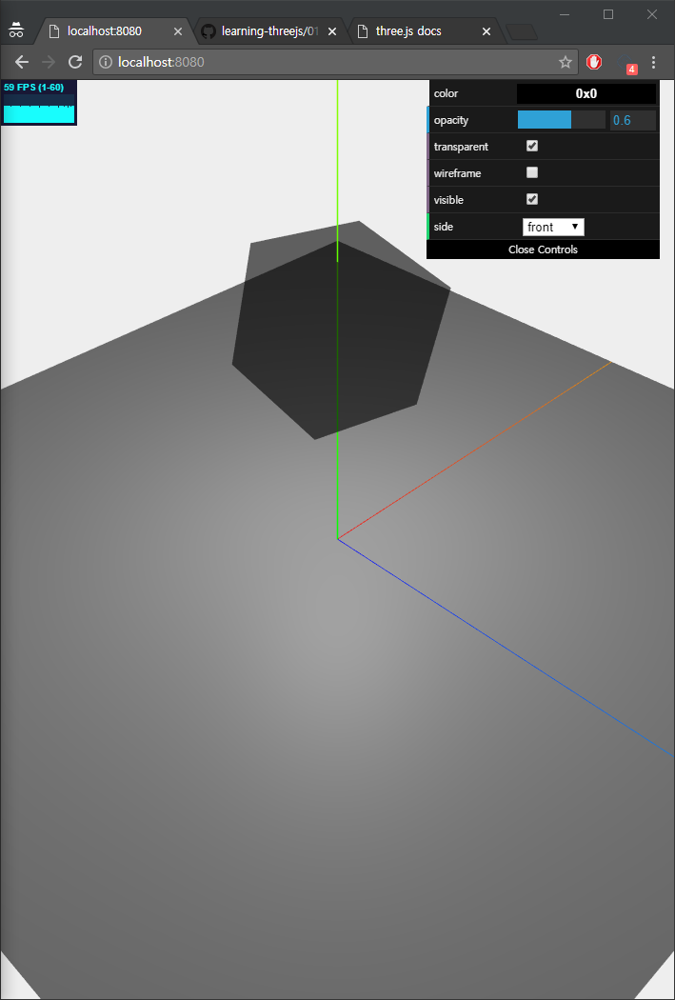
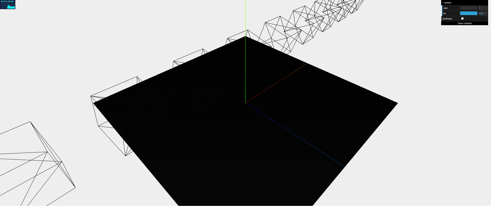
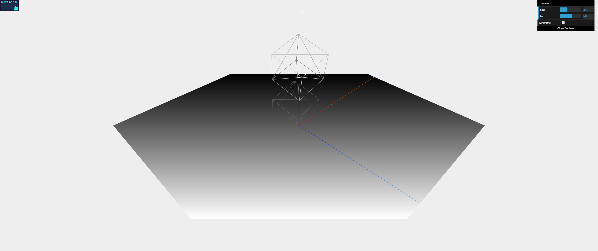
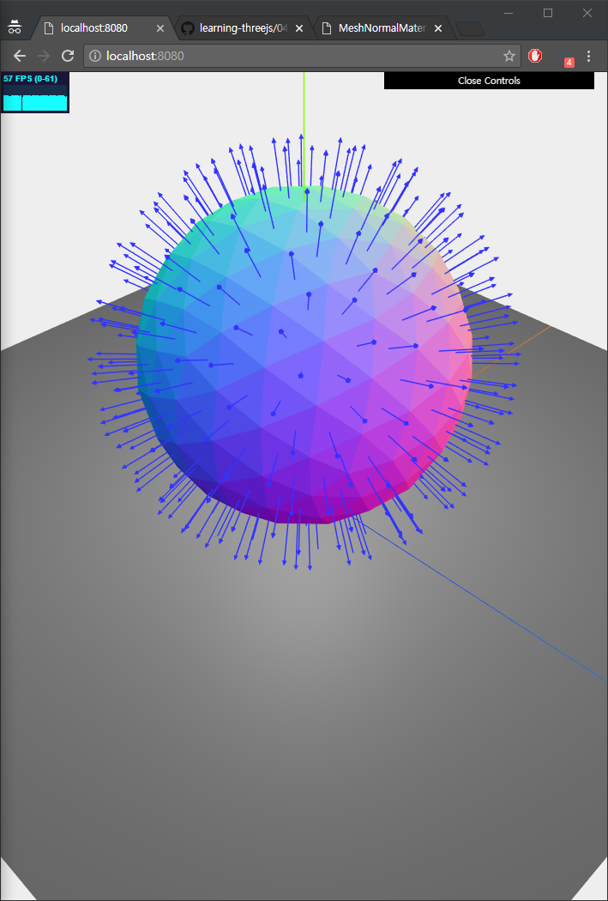

# Chapter4; ThreeJS Material
Geometry와 함께 Mesh를 구성하는 객체. Skin 이라고 생각해도 된다. 다음의 Material에 대해 알아본다고 함.

* [MeshBasicMaterial](https://threejs.org/docs/#api/en/materials/MeshBasicMaterial)
  * 가장 초보적인? 수준의 Material. 간단한 색상을 부여하거나 wireframe 을 위해 사용한다고 함
* [MeshDepthMaterial](https://threejs.org/docs/#api/en/materials/MeshDepthMaterial)
  * Camera 부터 떨어진 거리를 기준으로 색상을 결정하는 Material
* [MeshNormalMaterial](https://threejs.org/docs/#api/en/materials/MeshNormalMaterial)
  * [normal vector](http://mathworld.wolfram.com/NormalVector.html) 에 근거한 RGB 색상으로 결정하는 Material
* [MeshLambertMaterial](https://threejs.org/docs/#api/en/materials/MeshLambertMaterial)
  * 조명과 상호작용을 하지만 반짝이지 않는(non-shiny) 표면을 가진 Material
  * 무광이라고 생각하면 되겠다.
* [MeshPhongMaterial](https://threejs.org/docs/#api/en/materials/MeshPhongMaterial)
  * 조명과 상호작용하며 반짝이는(shiny) 표면을 가진 Material
  * 유광이라고 생각하면 되겠다.
* [ShaderMaterial](https://threejs.org/docs/#api/en/materials/ShaderMaterial)
 * 꼭지점과 픽셀의 색상을 직접 제어할 수 있는 user-custom shader Material
* [LineBasicMaterial](https://threejs.org/docs/#api/en/materials/LineBasicMaterial)
  * color가 있는 line을 만드는 [Line] Geometry에 쓰이는 Material
* [LineDashMaterial](https://threejs.org/docs/#api/en/materials/LineDashedMaterial)
  * [LineBasicMaterial]과 동일하지만, 점선으로 그리는 Material

다음은 좀 나중에 볼 Material 이라고 한다.

* [RawShaderMaterial](https://threejs.org/docs/#api/en/materials/RawShaderMaterial)
  * [BufferedGeometry]와 함께 사용해야 한다. [chapter11](chapter11.md)에서 본다고 함
* [SpriteCanvasMaterial](https://threejs.org/docs/#examples/SpriteCanvasMaterial)
  * 각각의 point에 스타일을 줄 때 사용한다고 한다???
  * [chapter7](chapter7.md) 에서 본다고 함.
* [SpriteMaterial](https://threejs.org/docs/#api/en/materials/SpriteMaterial)
  * [SpriteCanvasMaterial]과 동일
* [PointCloudMaterial](https://threejs.org/docs/#api/en/materials/PointsMaterial)
  * [SpriteCanvasMaterial]과 동일

뭐 많은데... 잘 보도록 하자. 참고로 책에서 언급되는 [MeshFaceMaterial]은 deprecated 되었다고 한다.

## Material Properties
먼저 Material 전체적으로 가지고 있는 속성이 있다고 한다. 얘네들에 대해 보도록 하자. 다음 세 종류로 나눠 설명한다고 함

* basic properties
  * 사용 빈도가 가장 높은 속성
  * opacity, id, name 등을 설정할 수 있다고 한다.
* blending properties
  * 배경 색상과 상호작용하는 방법을 정의하는 속성이라고 한다.
* advenced properties
  * low-level weblGL Context 객체를 렌더하는 방법을 제어할 때 사용하는 속성이라고 한다.
  * 때문에 거의 사용하지는 않는 속성들임

참고로, chapter4 에서는 texture와 map 관련 속성은 다루지 않는다고 한다. 물론 뒤에서 다룰 예정. 아마 혼동을 피하기 위해 이러한 구조를 가진 것으로 생각된다.

### Basic Properties
다음이 있다고 한다. 

* id
  * Material을 식별할 때 사용한다고 한다. Material 생성 시 할당된다고 함.
  * 생성 순서 기준으로 index 값을 갖는다.
    * 첫 번째 Material은 0
    * 두 번째 Material은 1
    * ...
* uuid
  * 고유하게 생성된 id
  * ThreeJS 내부적으로 사용된다
* name
  * 이 속성을 이용해 Material에 naming을 할 수 있다.
  * 보통 디버깅을 위해 사용한다고 함
* opacity
  * 말 그대로 Material의 투명도를 정의한다.
  * Range: [0, 1]
* transparent
  * `true`로 설정할 경우 opacity 와 함께 객체를 렌더한다.
  * `false`로 설정할 경우 투명해지지는 않고, 그냥 더 밝은 색상을 가지게 나타내어진다.
  * alpha-chanel 사용하는 texture의 경우 이 속성을 `true`로 해 놓아야 한다고 함.
* visible
  * 말 그대로 Material의 visibility를 정의
* side (default: [FrontSide])
  * Material을 적용할 Geometry상의 위치를 정의할 수 있다. [문서](https://threejs.org/docs/#api/en/constants/Materials)
  * [FrontSide]; Material을 전면(외부)에 적용
  * [BackSide]; Material을 후면(내부)에 적용
  * [DoubleSide]; Material을 양쪽 면에 적용
* needsUpdate
  * Material이 update 되었음을 ThreeJS 알린다.
  * ThreeJS는 _geometry.verticesNeedUpdate_ 와 마찬가지로, 성능상의 이유로 인해 Material을 caching한다. 때문에, 위 속성을 이용해 변경됨을 알리는 것이다.
  * 좀 다른게 있다면, cache를 변경된 Material로 update 한다는 점.
* overdraw
  * [CanvasRenderer] 라는 렌더러를 사용하면 Polygon의 경우 좀 더 크게 렌더되는데, 이 때 격차가 보인다면 이 속성을 `ture`로 설정한다고 함

### Blending Properties
렌더하는 색상이 배경색과 상호작용하는 방법을 결정한다고 한다. Material끼리 composition할 때, 이 속성에 대해 말한다고 함.

* blending
  * Material이 배경색(background)과 혼합하는 방법을 결정
  * normal-mode는 최상층(전경색?)만 표시하는 [NormalBlending] 이라고 한다.
    * 이 속성을 사용할 때 뭔 말인지 알 수 있을 것 같다.
  * 표준 blend 모드 외에 _blendsrc, blenddst, blendequation_ 속성을 이용해 user-custom blend 모드를 만들 수 있다고 한다.
    * 표준 blend 모드???가 뭔진모르겠지만...
* blendsrc (default: [SrcAlphaFactor])
  * 이 속성은 객체(Source)가 배경(Target)에 blending되는 방식을 정의한다고 한다.
  * 기본값인 [SrcAlphaFactor]는 blend에 alpha-chanel 을 사용한다고 함...
* blenddst (default: [OneMinusSrcAlphaFactor])
  * 배경(Target)이 blend에 사용되는 방법은 정의한다고 한다.
  * 기본값인 [OneMinusSrcAlphaFactor]는 [SrcAlphaFactor]와 마찬가지로 blending에 alpha-chanel 을 사용하지만, 하나의 alpha-chanel 만 사용한다고 한다.
* blendequation (default: [AddEquation])
  * blendsrc와 blenddst 값을 사용하는 방법을 정의한다.
  * 기본값인 [AddEquation]은 둘을 더하는 것이라고 한다.

[문서](https://threejs.org/docs/#api/en/constants/CustomBlendingEquations)

### Advence Properties
WebGL 내부 동작과 관련있기 때문에, 자세히 알아보지는 않는다고 한다. 자세히 알고싶으면 [참고](http://www.khronos.org/registry/OpenGL/specs/es/2.0/es_full_spec_2.0.pdf)

* depthTest
* depthWrite
* polygonOffset, polygonOffsetFactor, polygonOffsetUnits
* alphatest

### set property
두 가지 방법으로 속성을 정의할 수 있다고 한다.

* construct args
* setter

```js
// construct args
const basicMaterial_1 = new THREE.MeshBasicMaterial({
  color: 0xff0000,
  name: 'basicMaterial-1',
  /* ... */
})

// setter
const basicMaterial_2 = new THREE.MeshBasicMaterial()
basicMaterial_2.color = new THREE.Color(0xff0000)
basicMaterial_2.name = 'basicMaterial-2'
/* ... */
```
일반적으로는 생성자를 이용해 지정한다. 참고로 color같은 경우 [Color] 객체로 들어간다는 것을 주의하자.

## Basic ThreeJs Material
[MeshBasicMaterial], [MeshDepthMaterial], [MeshNormalMaterial]에 대해 보도록 한다. 모두 조명과 상호작용하지 않음

### MeshBasicMaterial
조명과 상호작용하지 '않는' 아주 단순한 수준의 Material이다. 떄문에, Mesh는 그냥 평면과 같이 보이는 Polygon으로 렌더된다.



속성을 보고 예제를 구현해보는 방식으로 진행하겠다.

#### MeshBasicMaterial Properties
다음의 속성이 있다.

* color
  * Material의 색상
  * 'round', 'bevel', 'miter' 가 있다.
  * 마찬가지로 [WebGLRenderer]에서 지원되지 않는다
* flatShading (default: [SmoothShading])
  * 셰이딩이 적용되는 방법을 정의
  * [SmoothShading], [NoShading], [FlatShading]을 적용할 수 있다고 함
* vertexColors (default: [NoColors])
  * vertex에 적용되는 개별 색상을 정의
  * [NoColors], [VertexColors]를 적용할 수 있다.
    * [VertexColors] 적용 시 [Geometry]의 Color 속성을 고려해 색상을 가져온다고 함
  * [CanvasRenderer]에서 지원되지 않는다.
* fog (default: true)
  * Scene에 적용했던 fog 설정에 영향을 받을지 여부
* wireframe (default: false)
  * Material을 wireframe으로 render
* wireframeLinewidth
  * wireframe의 width. 폭. 근데 적용은 되지 않는듯
* wireframeLinecap (default: 'round')
  * wireframe 선의 끝 모양. 'butt', 'round', 'square' 가 있다. 구분은 사실상 힘들다고 함
  * [WebGLRenderer]에서 지원되지 않는다고 함
* wireframeLinejoin (default: 'round')
  * wireframe 선의 연결 부위를 시각화하는 방법을 정의

#### implement MeshBasicMaterial
구현하는것은 별거 없다...

```js
function createHelper () {
  /* ... */

	// dat.GUI
	controls = {
		color: 0x000000,
		opacity: 1,
		transparent: false,
		wireframe: false,
		visible: true,
		side: 'front'
	}

	const gui = new dat.GUI()
	gui.addColor(controls, 'color').onChange(c => { solid.material.color = new THREE.Color(c)	})
	gui.add(controls, 'opacity', 0, 1, 0.1).onChange(val => { solid.material.opacity = val })
	gui.add(controls, 'transparent').onChange(b => { solid.material.transparent = b })
	gui.add(controls, 'wireframe').onChange(b => { solid.material.wireframe = b })
	gui.add(controls, 'visible').onChange(b => { solid.visible = b })
	gui.add(controls, 'side', ['front', 'back', 'double']).onChange(val => {
		switch (val) {
			case 'front': {
				solid.material.side = THREE.FrontSide
				break
			}
			case 'back': {
				solid.material.side = THREE.BackSide
				break
			}
			case 'double': {
				solid.material.side = THREE.DoubleSide
				break
			}
		}
	})
}
```
[1-MeshBasicMaterial.js](js/chapter4/1-MeshBasicMaterial.js)

visible 제외하고 material에 대한 properties 이기 때문에, material에 값을 지정해야 한다는 점을 주의하자

### MeshDepthMaterial
조명 뭐 이런것들과 상호작용하지 않고, 그저 Camera와의 거리(near, far)에 따라서만 Material의 feature가 결정된다.




이러한 특성으로 인해 보통 다른 Material과 결합해 Fading 효과를 낸다고 한다. 먼 애들은 점점 안보이고, 가까운 애들은 보이고 하니까...

#### MeshDepthMaterial Properties
떄문에 공통속성 제외하고는 의미있는 속성이라고는 wireframe 하나 뿐이다.

* wireframe (default: false)
* wireframeLineWidth

#### impl MeshDepthMaterial
구현해보면...

```js
function createPlane () {
	// create plane
	const planeGeometry = new THREE.PlaneGeometry(40, 40, 1, 1)
	const planeMaterial = new THREE.MeshDepthMaterial({ color: 0xffffff }) // color applied fail
	
	plane = new THREE.Mesh(planeGeometry, planeMaterial)
	plane.rotation.x = -Math.PI / 2 // rotate 90 deg
	plane.position.x = 0
	plane.position.y = 0
	plane.position.z = 0

	plane.receiveShadow = true // set receive shadow
	
	scene.add(plane)
}

function createObjects () {
	createPlane()

	const geometry = new THREE.BoxGeometry(5, 5, 5)

	const material = new THREE.MeshDepthMaterial({ wireframe: true })

	solid = new THREE.Object3D()

	for (var i = 0; i < 10; i++) {
		const m = new THREE.Mesh(geometry, material)
		m.position.z = i * -10 + 50
		solid.add(m)
	}

	solid.position.y = 10

	scene.add(solid)
}

function createHelper () {
  /* ... */

	// dat.GUI
	controls = {
		camera: {
			near: 0.1,
			far: 100
		}
	}

	const gui = new dat.GUI()

	const cameraFolder = gui.addFolder('camera')
	cameraFolder.add(controls.camera, 'near', 1, 100, 1).onChange(val => {
		camera.near = val
		camera.updateProjectionMatrix()
	})
	cameraFolder.add(controls.camera, 'far', 10, 100, 1).onChange(val => {
		camera.far = val
		camera.updateProjectionMatrix()
	})
}
```
[2-MeshDepthMaterial.js](js/chapter4/2-MeshDepthMaterial.js)

[MeshDepthMaterial]에 color를 적용할 수 없고, camera의 near와 far에 의해서만 상호작용하는 모습을 볼 수 있다...

참고로 이 때 camera의 properties를 업데이트 한 이후에는 _camera.updateProjectionMatrix()_ 를 호출해줘서 알려줘야 한다.

### MeshNormalMaterial
설명했듯이 normal vector. 즉, '법선'에 근거에 색을 결정하는 Material



사진상의 화살표는 법선을 나타낸 것이다.

#### MeshNormalMaterial Properties
때문에 얘도 지정할 수 있는 속성은 얼마 없다.

* wireframe
* wireframeLinewidth
* flatShading
  * [FlatShading]; 각진 모양으로 렌더
  * [SmoothShading]; 부드러운 모양으로 렌더

#### implement MeshNormalMaterial
구현해보면 다음과 같다.

```js
function createObjects () {
	createPlane()

	const geometry = new THREE.IcosahedronGeometry(7, 2)

	const material = new THREE.MeshNormalMaterial({
		flatShading: THREE.FlatShading
	})

	solid = new THREE.Mesh(geometry, material)

	solid.position.y = 7
	
	for (var i = 0; i < solid.geometry.faces.length; i++) {
    // normal vector helper

		const face = solid.geometry.faces[i]
		const centroid = new THREE.Vector3(0, 0, 0)

		// calc intermediate point
		centroid.add(solid.geometry.vertices[face.a])
		centroid.add(solid.geometry.vertices[face.b])
		centroid.add(solid.geometry.vertices[face.c])
		centroid.divideScalar(3)

		const arrow = new THREE.ArrowHelper(face.normal, centroid, 2, 0x3333ff, 0.2, 0.2)
		controls.helper.push(arrow) // for visible
		solid.add(arrow)
	}

	scene.add(solid)
}
```
[4-MeshNormalMaterial.js](js/chapter4/4-MeshNormalMaterial.js)

법선 계산은 그냥... 삼각형 중간 지점 구하고 [ArrowHelper]를 이용하면 된다. [ArrowHelper]는 그냥... 말 그대로 화살표 헬퍼 만들어주는 애라고 생각하면 된다.

중요한 것은 [MeshNormalMaterial] 부분이니까... flatShading 값을 [SmoothShading] 으로 바꿔보기도 해 보자.

### MeshFaceMaterial?
얘는 Geometry의 각 Face에 대해 서로 다른 Material을 적용할 수 있도록 하는... 일종의 Container 역할을 했던 애인데, 현재는 deprecated 되었다. [문서 참고](https://threejs.org/docs/#api/en/deprecated/DeprecatedList). 그럼 어떻게 이를 구현할 수 있을까? 방법은 어렵지 않다.

#### implement MeshFaceMaterial
그냥 Mesh 만들 때 Material을 Array로 넘겨주면 된다.

```js
function createObjects () {
	createPlane()

	const geometry = new THREE.BoxGeometry(3, 3, 3)

	const normalMaterial = new THREE.MeshNormalMaterial({ side: THREE.DoubleSide })
	const basicMaterial = new THREE.MeshBasicMaterial({ color: 0x00ff00, side: THREE.DoubleSide })
	const depthMaterial = new THREE.MeshDepthMaterial({ wireframe: true })

	const materials = [normalMaterial, basicMaterial, depthMaterial]

	solid = new THREE.Mesh(geometry, materials)
	solid.position.y = 5

	scene.add(solid)
}
```
[5-materials.js](js/chapter4/5-materials.js)

중간에 [Mesh] 생성자로 materials 배열을 넘기는게 보일 것이다.

### Docs

* [ArrowHelper](https://threejs.org/docs/#api/en/helpers/ArrowHelper)
  * visualizing directions

## Composite Materials
Advence Material로 넘거가기 전에... 별건 아니고, 위에서 본 Blending Properties에서 언급된 _blending_ 속성을 이용해 Materials끼리 서로 Composition을 할 수 있다. 다음과 같이 말이다.


위는 [MeshDepthMaterial]과 [MeshBasicMaterial]을 서로 결합해 만든 것이다. 다음과 같이 가능하다.

```js
function createObjects () {
	// createPlane()

	const geometry = new THREE.BoxGeometry(5, 5, 5)

	const depthMaterial = new THREE.MeshDepthMaterial()
	const basicMaterial = new THREE.MeshBasicMaterial({
		color: 0x00ff00,
		transparent: true, // added
		blending: THREE.MultiplyBlending // added
	})

	solid = new THREE.Object3D()

	for (var i = 0; i < 30; i++) {
		const mesh = new THREE.Object3D()

		const depthMesh = new THREE.Mesh(geometry, depthMaterial)
		const basicMesh = new THREE.Mesh(geometry, basicMaterial)

		depthMesh.scale.set(0.99, 0.99, 0.99)

		mesh.add(depthMesh)
		mesh.add(basicMesh)

		mesh.position.x = i * -10 + 150
		solid.add(mesh)
	}

	solid.position.y = 10

	scene.add(solid)
}

function createLights () {
	// create ambient light
	const ambientLight = new THREE.AmbientLight(0x484848)
	scene.add(ambientLight)

	// create point light
	const pointLight = new THREE.PointLight(0x5f5f5f)
	pointLight.distance = 100
	pointLight.castShadow = true
	pointLight.position.set(0, 10, 0)
	scene.add(pointLight)
}
```
[3-composition_materials.js](js/chapter4/3-composition_materials.js)

[Object3D]를 이용해 두 개의 Mesh를 결합하는데, 이 때 Material끼리 서로 상호작용하기 위해서는 상호작용을 할 대상 Material. 여기서는 [MeshBasicMaterial]이 되겠지, 아무튼 얘의 `blending`과 `transparent` 속성을 변경해줘야 한다.

여기서 `transparent`는 [MeshDepthMaterial]의 전경색에 대한 opacity를 유동적으로 만들어주기 위해, `blending`은 배경색(background)을 [MeshDepthMaterial]로 지정하기 위해 해주었다... 이렇게 생각하면 될 것 같다.

이 때 `blending`에 사용된 [MultiplyBlending]은 배경색과 전경색을 곱하는 것을 의미한다. 참고로 scale을 0.99로 설정해 준 것은, Material이 겹쳐서 깜빡이는? 그런 효과가 발생하기 때문.

## Advence Materials
말만 거창하지 [ShaderMaterial] 말고는 별거 없다.

### MeshLambertMaterial
조명과 상호작용하는 무광 표면을 가진 Material이다.

#### MeshLambertMaterial Properties
물론 위에서 본 기본적인 properties를 사용할 수 있고, 이 말고도 다음의 속성들이 있다.

* ambient (default: Color(0xffffff))
  * 무광이긴 하지만, 주변에 색을 띈다.
  * 즉, Material의 ambient-color 이다. 앞에서 본 ambient-light과 함께 multiply로 합쳐진다고 한다...
* emissive (default: Color(0x000000))
  * Material이 방출하는 색이라고 한다. 마찬가지로 무광이긴 하지만...
  * 다른 조명의 영향을 받지 않는다.
* wrapAround (default: false)
  * [half-lambert](https://image.slidesharecdn.com/wrappeddiffuse-131110230348-phpapp02/95/wrapped-diffuse-6-638.jpg?cb=1384124655) 조명 기술을 적용한다고 한다.
  * 빛의 감소를 줄어들게 함으로써 부드러운 그림자와 함께 빛을 고르게 배포하도록 하는... 그런 속성이다.
* wrapRGB (default: false)
  * true 시 [Vector3]를 이용해 빛이 감소하는 속도를 제어할 수 있다고 한다.

#### Implement MeshLambertMaterial
구현은 크게 뭐 다를게 없다.

```js
function createObjects () {
	createPlane()

	solid = new THREE.Object3D()

	const geometry = new THREE.BoxGeometry(3, 3, 3)
	
	const lambertMaterial = new THREE.MeshLambertMaterial({
		color: 0x00ff00
	})
	const normalMaterial = new THREE.MeshBasicMaterial({
		color: 0x00ff00
	})

	const lambertMesh = new THREE.Mesh(geometry, lambertMaterial)
	const normalMesh = new THREE.Mesh(geometry, normalMaterial)

	lambertMesh.position.x = -5
	normalMesh.position.x = 5

	solid.add(lambertMesh)
	solid.add(normalMesh)

	solid.position.y = 10

	scene.add(solid)
}
```
[6-LambertMaterial.js](js/chapter6/6-LambertMaterial.js)

조명은 위(y=20)에서 내려오고, [BasicMaterial]과는 다르게 [LambertMaterial]은 이와 상호작용을 한다.

### MeshPhongMaterial
[LambertMaterial]과 거의 같다. 얘는 '유광' 표면을 가진다.

#### MeshPhongMateral Properties

* ambient
* emissive
* wrapAround
* wrapRGB

* specular
  * Material이 어떻게 빛날지 정의한다.
  * 참고로 `color` 속성과 동일한 색으로 설정되어있으면, 금속 재질같은 Material로 구현이 된다고 한다.
  * Gary에 가까워질수록 플라스틱같아보인다고함...
* shininess (default: 30)
  * [specular highlight](https://en.wikipedia.org/wiki/Specular_highlight). 얼마나 광?이 날지 정의한다.
* metal (default: false)
  * true 시 말 그대로 좀 더 금속처럼 보이게 한댄다.
  * 효과는 그리 크지 않는다고 한댄다.
